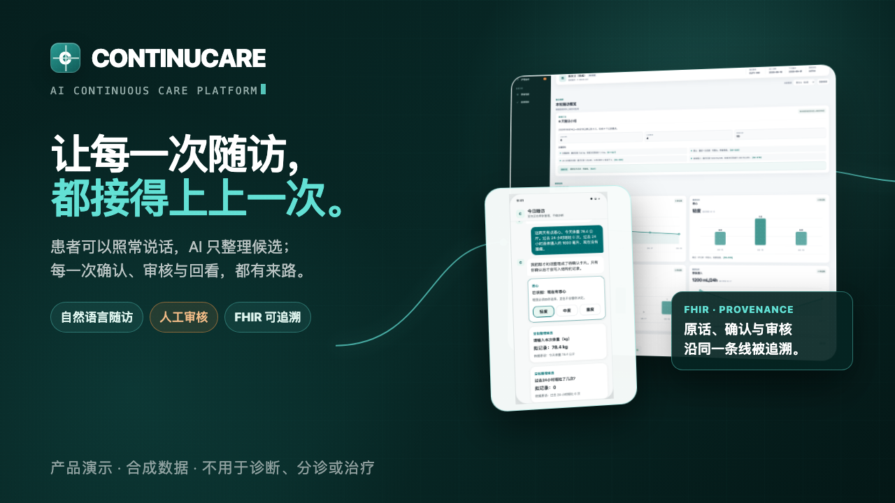
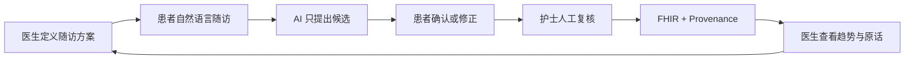
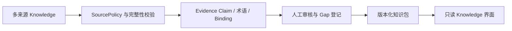
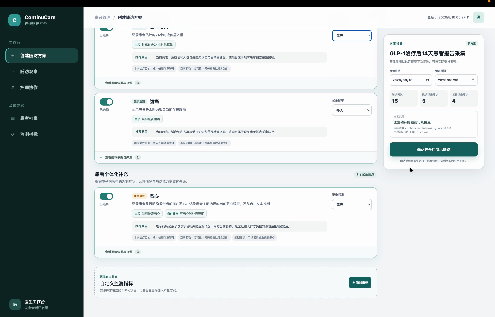
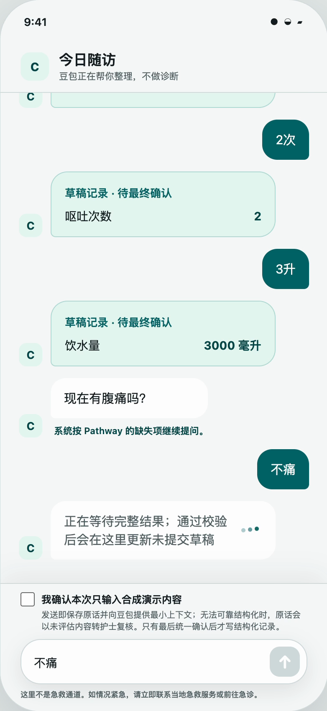
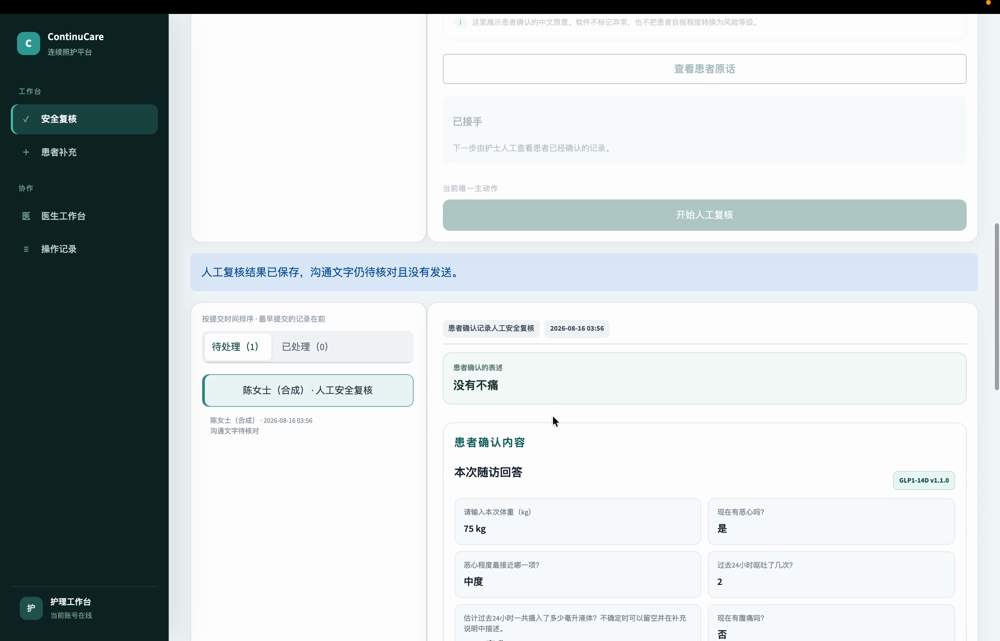
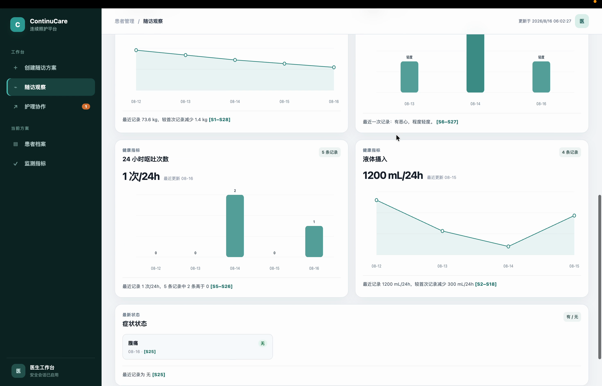

<p align="center">
  
</p>

<h1 align="center">ContinuCare</h1>

<p align="center">
  <strong>让院外一句话，变成复诊前可追溯的记录。</strong><br>
  A knowledge-grounded continuous-care prototype with patient confirmation, human review and FHIR provenance.
</p>

<p align="center">
  
  
  
  
  
  
</p>

ContinuCare 是一个使用合成数据的连续照护 Web 原型：医生先定义随访方案，患者用自然语言反馈，AI 只整理待确认候选；患者确认后由护士人工复核，并以 FHIR 资源与 Provenance 保留从原话到临床工作流的来龙去脉。医生最终能从趋势回到患者原话、确认动作和审核记录。

> [!IMPORTANT]
> **仅限工程演示。** 本项目不是医疗器械或急救通道，不诊断、不治疗、不分诊、不生成用药建议，也不代表临床验证或医院生产部署。所有人物、身份、消息与健康数据均为合成演示内容。

## 共同创作 / Collaboration

本项目由 [Ziyue Zhang](https://github.com/ZIYUEZHANG0731) 与 [xli561980-ship-it](https://github.com/xli561980-ship-it) **共同设计与开发**。该独立仓库由 Ziyue Zhang 维护，用于作品集和工程展示；完整 Git 历史保留双方贡献记录，并明确关联[最初的协作仓库](https://github.com/xli561980-ship-it/continucare-demo)。详见 [AUTHORS.md](AUTHORS.md) 与 [NOTICE.md](NOTICE.md)。

## 一条可追溯的照护链



核心设计不是让模型替人做临床判断，而是让每个状态变化都有明确责任人和证据来源：

- **患者可以照常说话**：自然语言先被整理为候选，确认前不写入正式结构化记录。
- **人保留最终决定权**：护士核对原话、时间、单位、缺失和冲突后，才决定记录、补充或上报。
- **医生看得到来龙去脉**：趋势、患者原话、确认动作和审核状态通过版本链与 Provenance 关联。
- **失败时停止而不是猜测**：缺少配置、证据或获批规则时保持 fail-closed，不输出风险等级或诊疗建议。

## 核心特点：把多来源 Knowledge 变成可治理的知识层

ContinuCare 的差异化不只是调用一个大模型回答问题。项目吸收并整理来自监管机构、药品标签、患者教育资料与文献元数据等多来源 **Knowledge**，再将其转化为有出处、可审核、可版本化的结构化知识资产。当前证据基础登记了 **15 个独立来源记录和 13 个精确历史别名**，并支持将经过治理的知识包确定性编译为 Source、Product、Evidence Claim、Metric 与 FHIR 产物。



- **吸收多种知识形态**：既处理来源文档，也处理药品产品、证据主张、指标、术语映射和来源连接器契约；当前已覆盖 DailyMed、EMA、MedlinePlus、PubMed 与 PMC 等连接器合同。
- **每条知识都能回到出处**：保存来源定位、摘要哈希、版本、前序链与精确引用，避免把标题相似或二手转述误当成同一证据。
- **不确定性不会被“补全”**：未知、歧义、未审核或权利状态未解决的内容进入 Gap 或 withheld 状态，由后续审核和新版本处理。
- **知识与运行权限严格分离**：Knowledge 只提供信息背景，保持 `knowledge_effect=informational_only` 与 `runtime_authority=none`；它不能直接改写患者状态、创建临床结论或触发诊疗动作。

连接器合同和离线验证并不等同于已启用在线采集：当前真实来源的 live acquisition 仍关闭，部分 rights/review Gap 仍待完成。实现细节见 [Knowledge Evidence Foundation](docs/25_knowledge_evidence_foundation.md) 与 [Knowledge Capability Review Guide](docs/32_knowledge_capability_review_guide.md)。

## 产品界面

<table>
  <tr>
    <td width="50%" align="center"><strong>医生定义患者随访方案</strong></td>
    <td width="50%" align="center"><strong>患者自然表达并确认候选</strong></td>
  </tr>
  <tr>
    <td></td>
    <td align="center"></td>
  </tr>
  <tr>
    <td width="50%" align="center"><strong>护士人工安全复核</strong></td>
    <td width="50%" align="center"><strong>医生查看趋势与证据来源</strong></td>
  </tr>
  <tr>
    <td></td>
    <td></td>
  </tr>
</table>

## 未来版本 / Practical Roadmap

这条路线按**可独立实施的能力优先、外部依赖后置**来安排。它不是发布时间承诺；版本只有满足明确验收门槛后才推进，医院合作、真实数据和临床使用不会被当作普通功能开关。

| 版本 | 核心成果 | 可实施范围 | 验收门槛 |
|---|---|---|---|
| **v0.1 · 当前原型** | 证明三端闭环可运行、可追溯 | 合成数据演示、患者自然语言确认、护士人工复核、医生趋势回看、FHIR Provenance、多来源 Knowledge 治理基础 | 当前仓库已实现；不用于真实临床 |
| **v0.2 · Knowledge Core** | 把“吸收 Knowledge”做成项目最强的通用能力 | 可插拔知识包；Source → Claim → Binding → Gap 全链路；正式 `KnowledgeRelease`；来源权利、人工审核、引用和版本差异界面 | 新知识包可在不改业务代码的情况下加入；构建结果可复现；未审核或权利不明内容无法发布 |
| **v0.3 · Care Builder** | 用同一套知识与数据合同配置不同照护流程 | Pathway Studio、动态 Questionnaire、纵向 Clinical Memory、医生摘要反馈，以及 2–3 套完全合成的示例流程 | 新流程通过配置生成而非复制代码；患者确认和护士审核门不能绕过；模型仍不决定医学代码或临床结论 |
| **v0.4 · Pilot Sandbox** | 在不接触真实患者的前提下补齐医院级工程能力 | 真实角色模型、SSO/RBAC 接口、细粒度审计、数据隔离、FHIR Profile 验证、EMR 模拟器/只读适配器、可观测性和故障演练 | 使用合成或机构批准的去标识数据通过安全测试、权限测试、恢复演练和接口合同测试 |
| **v0.5 · Controlled Pilot** | 与一个合作科室验证真实工作流价值 | 对接该机构的 IAM 与只读 FHIR/EMR；经批准的消息通道；患者授权、数据最小化、人工支持、回滚和事件响应 | 医院法务、伦理、信息安全和临床治理全部批准；预先定义的安全与使用指标达标；默认不写回 EMR |
| **v1.0 · Deployment Candidate** | 把已验证的试点能力固化为可部署候选版本 | 私有化部署、高可用、加密与密钥管理、备份恢复、运维监控、模型与 Knowledge 版本治理；再评估多科室扩展 | 只有受控试点证明安全、可用且确有价值后才进入；仍不替代医生决策 |

实际执行重点是先完成 **v0.2 和 v0.3**：这两阶段不依赖医院资源，能直接增强公开作品的技术深度与产品辨识度。v0.4 先做合成医院沙盒；v0.5 及以后必须等待真实合作方与正式审批，不能靠演示数据宣称完成。

## 最快启动

要求：Python 3.11+、Node.js 20+。所有命令都从仓库根目录执行。

```bash
python3 -m venv .venv
.venv/bin/python -m pip install -e '.[dev]'
npm --prefix patient-web ci
npm --prefix patient-web run build
npm --prefix doctor-web ci
npm --prefix doctor-web run build
cp .env.example .env
# 编辑 .env，填写本机 ARK_API_KEY 后再启动完整交互演示
.venv/bin/python scripts/start_demo.py --open
```

`start_demo.py` 会让两个后端共享 `.env` 中的同一数据库，等待服务就绪，并在使用 `--open` 时打开三个页面：

| 角色 | 地址 | 用途 |
|---|---|---|
| 医生端 | <http://127.0.0.1:8520/> | 创建/更新随访方案、查看趋势和护士上报 |
| 患者端 | <http://127.0.0.1:8510/> | 按医生方案完成自然语言随访并确认事实 |
| 护士端 | <http://127.0.0.1:8510/nurse> | 人工复核患者记录、记录结果或上报医生 |

本地回环地址默认无需登录。停止时在启动终端按 `Ctrl+C`，两个服务会一起退出。更详细的配置、手动启动和故障排查见 [本地运行手册](docs/quickstart.md)。

## 完整使用顺序

1. 先打开医生端，在“创建随访方案”中确认记录内容、频率和周期。确认后才会激活患者随访。
2. 打开患者端，按页面提示输入合成随访信息，检查系统整理的候选内容，并由患者明确确认。
3. 打开护士端，接收任务、开始复核、勾选核对项并记录人工处理结果；需要时选择上报医生。
4. 返回医生端“护理协作”查看护士上报，在“患者随访”查看结构化记录和趋势。
5. 刷新任一页面，状态会从共享 SQLite 事实恢复，不依赖浏览器 session state。

演示必须使用合成数据。标准讲解顺序和失败恢复见 [三端演示脚本](docs/demo_scripts.md)。

## 配置模式

复制 `.env.example` 后，运行数据默认写入被 Git 忽略的 `data/continucare.db`。当前最新患者网页要求真实配置豆包后才允许自然语言整理；缺少 Key 时会明确停止该操作，不会把离线 Mock 冒充成在线模型结果。

### 1. 无 Key 工程检查

不填写 `ARK_API_KEY` 时，可以安装、构建、启动页面、查看等待状态并运行离线自动化测试；不能完成患者自然语言输入后的三端业务闭环。患者页会显示“豆包当前未配置”，并禁用发送操作。

```dotenv
CONTINUCARE_DB_PATH=data/continucare.db
CONTINUCARE_MODE=local_stable_demo
CONTINUCARE_PATIENT_TIMEZONE=Asia/Shanghai
ARK_API_KEY=
CONTINUCARE_USE_SUMMARY_LLM=false
CONTINUCARE_EXTERNAL_EGRESS_ENABLED=false
```

### 2. 火山方舟豆包完整演示（推荐使用路径）

只在本机被忽略的 `.env` 中填写轮换后的 Key：

```dotenv
CONTINUCARE_LLM_PROVIDER=volcengine_doubao
CONTINUCARE_LLM_MODEL=doubao-seed-2-0-lite-260215
CONTINUCARE_LLM_BASE_URL=https://ark.cn-beijing.volces.com/api/v3
CONTINUCARE_LLM_API_KEY_ENV=ARK_API_KEY
ARK_API_KEY=replace-with-a-local-secret
CONTINUCARE_LLM_PROMPT_VERSION=doubao-semantic-extraction-v1
CONTINUCARE_USE_SAFETY_LLM=true
CONTINUCARE_SAFETY_PROMPT_VERSION=doubao-safety-critic-v1
CONTINUCARE_USE_LANGUAGE_LLM=true
CONTINUCARE_LANGUAGE_PROMPT_VERSION=doubao-language-rewrite-v1
CONTINUCARE_USE_SUMMARY_LLM=false
CONTINUCARE_SUMMARY_PROMPT_VERSION=doubao-summary-outline-v1
CONTINUCARE_LLM_TIMEOUT_SECONDS=60
```

最小联通检查：

```bash
.venv/bin/python scripts/mimo_smoke_test.py
```

脚本名为历史兼容名称，会读取当前 `CONTINUCARE_LLM_*` 配置。当前三端主流程只调用豆包做受控语义抽取，随后由本地硬规则、术语映射和患者确认门接管；仓库中的 Safety LLM、语言 LLM 和 Summary LLM 属于独立可选能力，当前三端适配器不会调用它们。模型不生成或决定医学代码，未配置或结果未通过安全校验时主流程 fail-closed，保留已有记录并要求重试。禁止发送真实患者数据。

### 3. 飞书 / Aily / Bitable

默认全部处于安全的 Mock/disabled 状态：

```dotenv
CONTINUCARE_FEISHU_MODE=mock
CONTINUCARE_AILY_MODE=mock
CONTINUCARE_BITABLE_MODE=disabled
CONTINUCARE_EXTERNAL_EGRESS_ENABLED=false
```

当前仓库只完成协议适配器和 FakeTransport 合同验证，没有完成真实租户或生产验证。仅修改 mode 不会启用外部访问；还必须同时显式启用对应 capability、全局 egress 并提供完整配置。详见 [飞书 / Aily 集成边界](docs/feishu_integration.md)。

## 当前主线架构

```text
医生 React (:8520) ─┐
                    ├─ Starlette 服务 ─ SQLite 事实库 ─ FHIR/审计/版本链
患者 React (:8510) ─┤
护士 React (:8510/nurse) ┘
```

- 医生确认方案会原子地保存版本并激活患者随访。
- 患者自由表达只产生待确认候选；确认后才写入完整 `QuestionnaireResponse` 和可追溯 `Observation`。
- 护士复核是人工工作流，系统没有未经批准的临床阈值，不自动分诊。
- 医生端只显示与角色相关的最小必要投影；所有写操作由服务端重新校验状态和角色边界。
- Knowledge 是独立只读资料库，`knowledge_effect=informational_only`、`runtime_authority=none`，不授权运行时动作。
- Streamlit `app.py` 仅保留为历史综合演示壳和技术资料入口，不是当前推荐主流程。

实施架构见 [整体六层方案](docs/14_layered_solution_blueprint.md) 和 [当前实现架构](docs/implementation_architecture.md)。

## 验证

日常本地验收：

```bash
.venv/bin/python -m pytest -q
.venv/bin/python scripts/rehearse_demo.py
npm --prefix patient-web run build
npm --prefix doctor-web run build
.venv/bin/python scripts/start_demo.py --check
```

普通离线测试不下载外部文件。未设置 `FHIR_R4_SCHEMA_ZIP` 时，依赖 HL7 官方 Schema 的 3 项测试会明确显示 skipped；比赛发布验收不能把这些 skip 视为通过。完整 FHIR Schema 哈希校验、知识包重建和发布门见 [验收说明](docs/evaluation.md)。

## 目录导航

| 路径 | 内容 |
|---|---|
| `continucare/` | Python 业务服务、FHIR、Care Agent、知识治理和角色边界 |
| `patient-web/` | 患者端与护士端 React/Vite 前端 |
| `doctor-web/` | 医生端 React/Vite 前端 |
| `scripts/start_demo.py` | 推荐的本地三端启动器 |
| `tests/` | 单元、集成、安全边界和三端闭环测试 |
| `docs/` | 产品、架构、数据、验证与演示文档 |
| `submission/` | 比赛提交材料；不属于运行时依赖 |

`data/`、`.env`、`output/`、`movie/`、前端 `dist/` 和 `node_modules/` 均为本地产物，不进入 Git。原始录屏和本地数据库不能作为主线运行依赖。

## 工程与临床边界

- 原始回答与 FHIR `Observation` 通过 `derivedFrom` 可追溯。
- 定时随访只使用发布包固定的 Questionnaire linkId 白名单；模型不能提供医学代码。
- 没有获批临床规则时保持 fail-closed，不输出风险等级或 Alert。
- 当前知识库中仍有部分来源和产品证据标记为 incomplete，不能夸大为完整临床覆盖。
- 真实 IAM/EMR、医院 Profile、临床规则审批、真实飞书/Aily 联调、消息实际发送和生产隐私合规均不在当前完成范围。

知识版本、证据覆盖与运行边界见 [Knowledge Evidence Foundation](docs/25_knowledge_evidence_foundation.md) 与 [Knowledge Capability Review Guide](docs/32_knowledge_capability_review_guide.md)。所有演示身份、消息和结果均为合成数据；禁止提交密钥、运行数据库或真实患者信息。

## 使用许可 / License

Copyright © 2026 **Ziyue Zhang** and **xli561980-ship-it**. All rights reserved.

本仓库公开用于作品集、评估与工程演示，**未授予开源许可证**。除 GitHub 服务条款及适用法律另有规定外，未经两位共同著作权人事先书面同意，不得复制、修改、再分发、再许可或商业使用本项目。第三方依赖及素材仍分别受其自身许可约束。详见 [NOTICE.md](NOTICE.md)。
