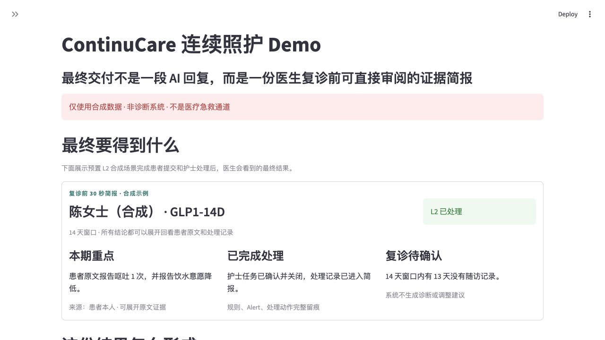
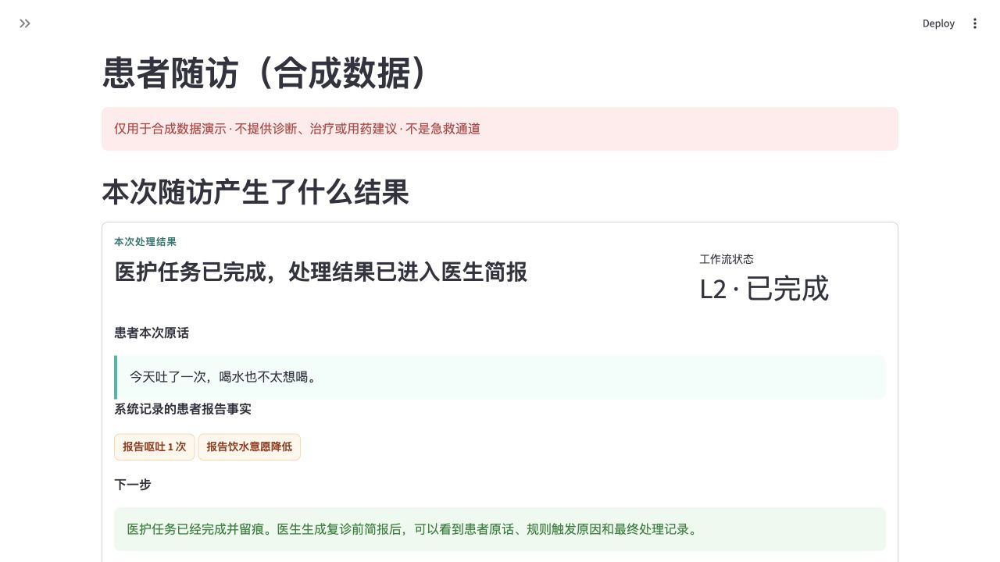
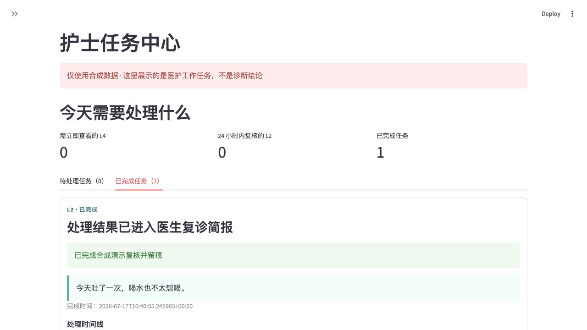
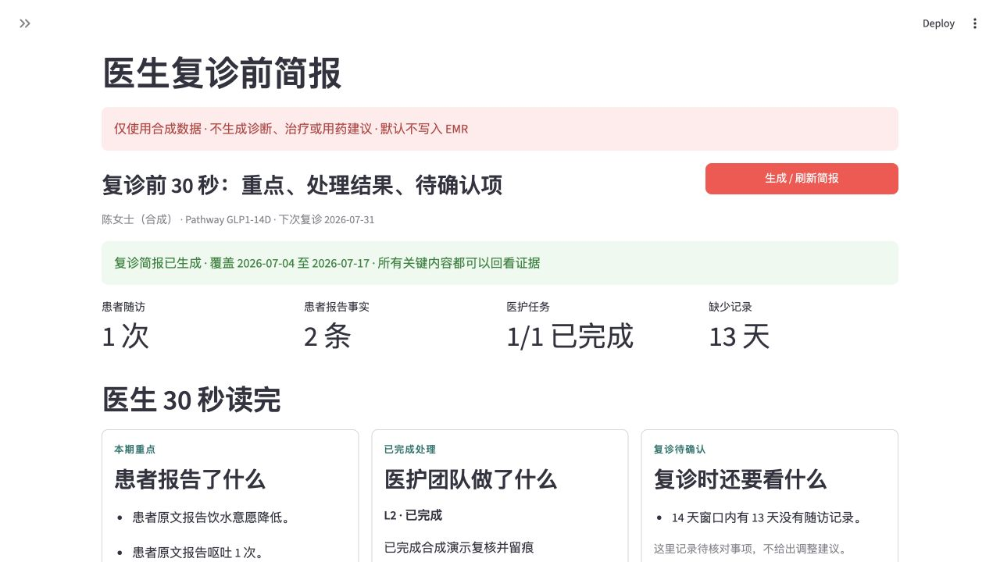
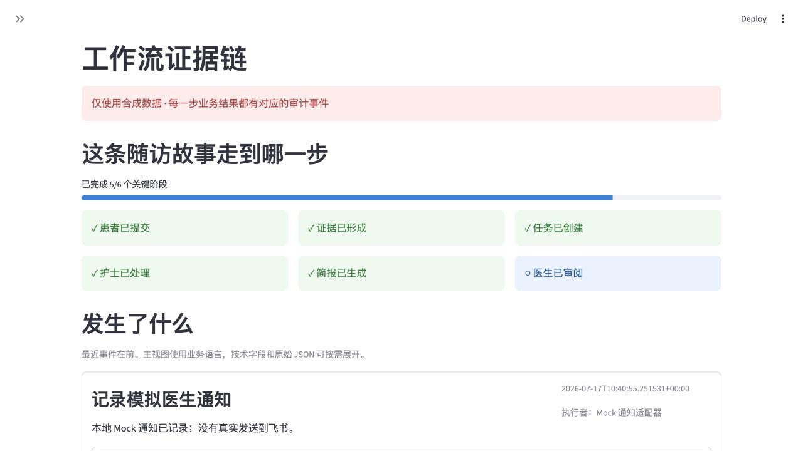
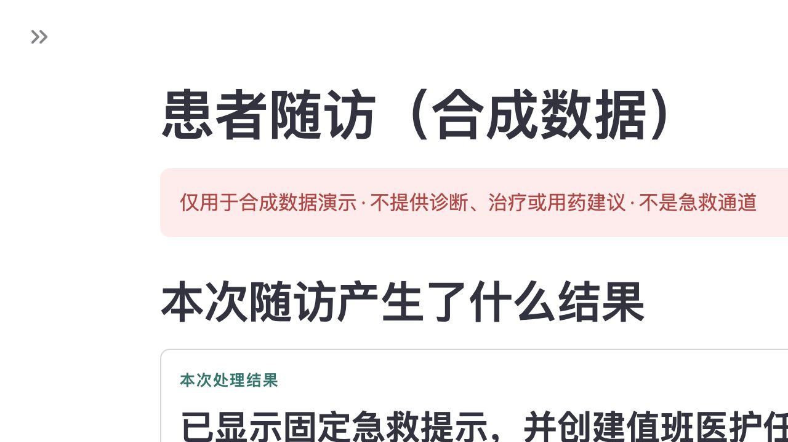
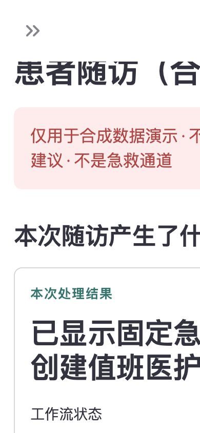

# ContinuCare Demo

把合成患者的院外随访输入转化为一份医生复诊前可直接审阅的证据简报，并让患者、护士和医生都清楚看到“本次产生了什么结果、下一步由谁处理”。

> **安全边界：仅使用合成数据。系统不是医疗急救通道，不生成诊断、治疗或用药建议。**

当前版本默认运行在“本地稳定演示模式”：数据写入本地 SQLite，抽取使用明确标注的本地 Mock，飞书通知使用明确标注的 Mock 适配器。无需任何外部 API Key。

## 本地运行

要求 Python 3.11+。

```bash
python3.11 -m venv .venv
.venv/bin/python -m pip install -e '.[dev]'
.venv/bin/python -m pytest -q
.venv/bin/streamlit run app.py
```

打开 Streamlit 输出的本地地址即可进入首页。运行数据默认保存在 `data/continucare.db`，该目录已被 Git 忽略。

## 三个核心价值

- 原文证据与结构化 Observation 双向可追溯；
- L0/L2/L4 由确定性规则产生，不把治理等级交给模型；
- Alert 处理、Summary 审阅和 Mock 通知全部进入本地审计链。

## 页面

- 首页：先展示最终交付物，以及患者 → 护士 → 医生的闭环；
- 患者随访：先展示本次结果、患者原话、记录事实和明确下一步；
- 护士任务中心：先展示今天要处理什么、为什么进入队列以及任务最终结果；
- 医生复诊简报：首屏用 30 秒呈现“患者报告、团队处理、复诊待确认”；
- 工作流证据链：用人类可读的六阶段时间线还原结果形成过程，技术记录按需展开。

## 关键截图

以下截图由本地 Streamlit Demo 真实渲染生成，内容均为合成数据。

### 首页：明确最终要得到什么



### 患者：本次随访结果与下一步



### 护士：已完成任务的最终结果



### 医生：30 秒复诊前简报



### 工作流：人类可读的结果形成过程



### L4 固定急救提示



### 手机端患者结果页



## 当前实施范围

- M0–M5：本地无 Key 闭环，按 [实施交接规范](CODEX_DEMO_IMPLEMENTATION_HANDOFF.md) 实现
- M6：真实飞书/Aily 接入，明确不在第一版范围内

## 演示

- [60–90 秒与 2–3 分钟脚本](docs/demo_scripts.md)
- [安全边界](docs/implementation_safety.md)
- [实施架构](docs/implementation_architecture.md)
- [飞书 / Aily 集成状态](docs/feishu_integration.md)
- 连续三次无外部服务彩排：`.venv/bin/python scripts/rehearse_demo.py`

## 验收命令

```bash
.venv/bin/python -m pytest -q
.venv/bin/streamlit run app.py
```

所有演示身份、消息和结果均为合成数据。禁止把运行数据库、密钥或真实患者信息提交到仓库。
