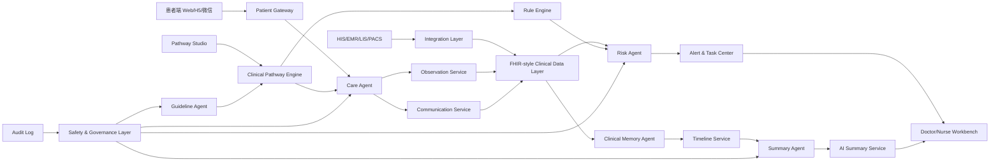
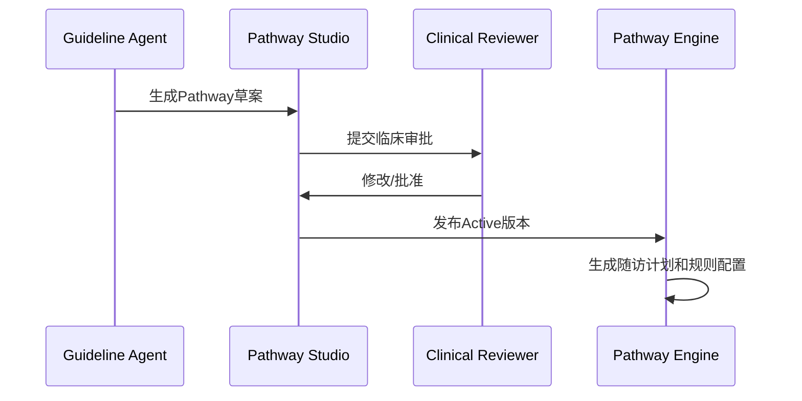
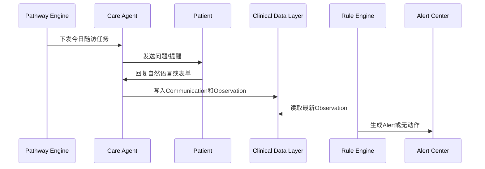
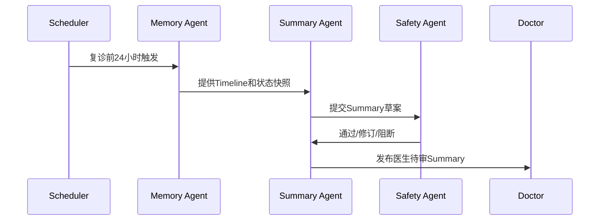

# 02. 系统架构设计

## 1. 架构目标

系统要支持真实医院落地，而不是单次比赛Demo。因此架构必须满足：

- 临床安全边界清晰。
- 数据模型稳定可扩展。
- Pathway可配置。
- Agent可编排、可审计、可降级。
- 规则引擎优先于LLM做高风险判断。
- 支持旁路部署和后续HIS/EMR集成。

## 2. 总体架构

## 3. 分层设计

### 3.1 Experience Layer

面向用户的应用层：

- 医生工作台。
- 护士风险中心。
- 患者随访端。
- 管理后台。
- Pathway Studio。

### 3.2 Application Layer

承载业务逻辑：

- Patient Service。
- Encounter Service。
- Observation Service。
- Communication Service。
- Pathway Engine。
- Rule Engine。
- Alert & Task Center。
- Timeline Service。
- Summary Service。

### 3.3 Agent Layer

负责AI能力：

- Guideline Agent。
- Care Agent。
- Clinical Memory Agent。
- Risk Agent。
- Summary Agent。
- Safety Agent。

### 3.4 Data Layer

负责数据持久化：

- FHIR-style Clinical Data Store。
- Pathway Definition Store。
- Conversation Store。
- Timeline Store。
- Alert/Task Store。
- Evidence Store。
- Audit Log Store。

### 3.5 Integration Layer

对接医院系统：

- HIS。
- EMR。
- LIS。
- PACS。
- 消息平台。
- SSO/LDAP。
- 医院主数据系统。

## 4. 核心模块职责

| 模块 | 职责 |
|---|---|
| Patient Gateway | 患者身份、授权、消息收发、频控 |
| Doctor Workbench | Summary、Timeline、趋势、风险和证据查看 |
| Nurse Risk Center | Alert队列、任务处理、升级和SLA |
| Pathway Studio | 创建、编辑、审批和发布Pathway |
| Pathway Engine | 根据Pathway生成随访计划、Observation配置和规则 |
| Rule Engine | 执行确定性规则，生成风险候选 |
| Agent Orchestrator | 管理Agent调用、上下文、工具权限和日志 |
| Safety Layer | 证据检查、置信度、禁忌表达、人工审批 |
| Clinical Data Layer | 存储患者、观察、沟通、摘要、Timeline等资源 |
| Integration Layer | 数据同步、身份映射、接口转换 |

## 5. 数据流

### 5.1 Pathway配置流

### 5.2 随访数据流

### 5.3 复诊摘要流

## 6. Agent Orchestration

Agent不是自由对话机器人，而是受控的任务执行器。

每次Agent调用必须包含：

- 调用目的。
- 输入资源引用。
- 可访问工具。
- Prompt版本。
- 模型版本。
- 输出Schema。
- 置信度。
- 证据引用。
- 审计ID。

## 7. Rule Engine 与 LLM 分工

| 任务 | Rule Engine | LLM |
|---|---|---|
| 阈值判断 | 负责 | 不负责 |
| 趋势判断 | 负责基础计算 | 可解释趋势 |
| 急症关键词 | 负责兜底词典和规则 | 辅助理解自然语言 |
| 患者表达理解 | 不擅长 | 负责结构化提取 |
| Summary生成 | 不负责 | 负责草稿 |
| 医疗建议 | 不负责 | 不允许 |

## 8. 部署形态

### 8.1 比赛Demo

- 单体应用或轻量前后端。
- 模拟患者数据。
- 模拟消息通道。
- 内置Pathway模板。
- 本地或云端Demo。

### 8.2 医院试点

- 私有化部署或医院专有云。
- 与HIS/EMR只读集成。
- 单科室、单路径试点。
- 医护账号和患者授权。
- 审计日志和权限控制上线。

### 8.3 医院生产

- 高可用服务。
- SSO。
- 数据加密。
- 多科室Pathway管理。
- 接口监控。
- 灾备和日志归档。
- 模型调用隔离和脱敏。

## 9. 集成原则

第一阶段采用旁路系统：

- 从HIS/EMR读取患者、Encounter、药物和复诊信息。
- 不自动改医嘱。
- 不自动写入正式病历。
- Summary写回必须医生审批。

长期可支持：

- FHIR API。
- HL7 v2消息。
- 医院私有接口。
- CSV/Excel批量导入。
- 医院SSO。

## 10. 关键技术风险

| 风险 | 对策 |
|---|---|
| Alert过多导致疲劳 | 分级、去重、合并、静默期、SLA |
| LLM幻觉 | 结构化输出、证据链、Safety Agent、禁忌表达检查 |
| 医院接口复杂 | 先旁路部署，后分阶段集成 |
| 医护不信任 | 每条结论可追溯，医生可编辑和反馈 |
| 患者低依从 | 简短问题、提醒、低负担交互 |
| 医疗责任不清 | 明确AI边界、人工审批、急症流程 |

