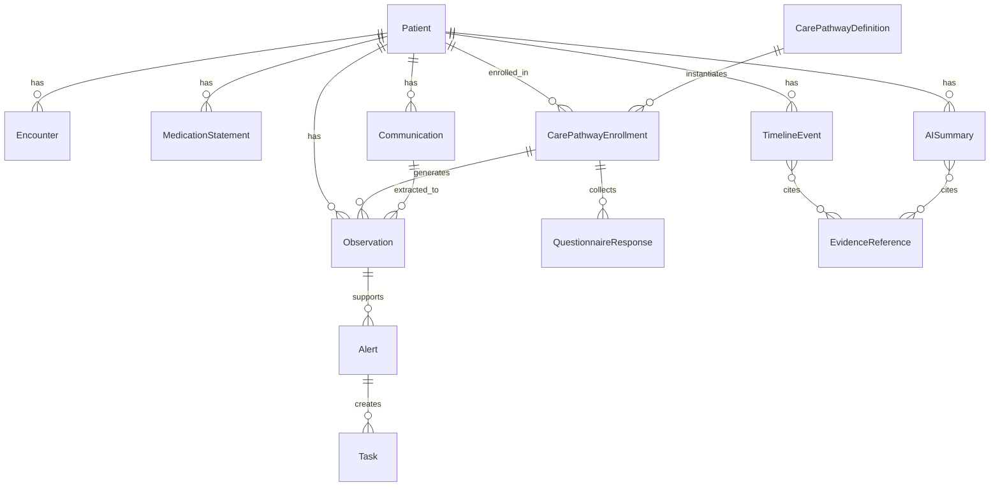

# 03. FHIR风格数据模型

## 1. 设计原则

本系统参考FHIR思想，但不要求第一版完全实现FHIR服务器。内部模型应保持FHIR兼容性，方便未来与医院系统、科研数据和标准接口对接。

原则：

- 不围绕疾病建模，而围绕Patient、Observation、Encounter、Communication、Pathway和Timeline建模。
- 临床事实和AI解释分开存储。
- 所有AI输出保留证据引用。
- 结构化数据优先，自然语言原文永远保留。
- Alert内部可作为业务实体，但对外映射到FHIR时应组合使用Flag、DetectedIssue、RiskAssessment、Task等资源。

## 2. 核心实体关系



## 3. Patient

### 3.1 用途

表示患者身份、联系方式、授权和与医院主索引的映射。

### 3.2 关键字段

| 字段 | 类型 | 说明 |
|---|---|---|
| patient_id | string | 系统内部ID |
| mrn | string | 医院病案号或主索引号 |
| name | string | 姓名 |
| birth_date | date | 出生日期 |
| sex | enum | 生理性别 |
| contact | object | 电话、短信、微信、App等 |
| emergency_contact | object | 紧急联系人 |
| consent_status | enum | 随访授权状态 |
| preferred_language | string | 偏好语言 |
| primary_department | string | 主要管理科室 |

### 3.3 关系

- 一个Patient可以有多个Encounter。
- 一个Patient可以加入多个CarePathwayEnrollment。
- 所有Observation、Communication、Alert、Summary都必须归属Patient。

## 4. Encounter

### 4.1 用途

表示一次门诊、急诊、住院、手术或复诊事件。

### 4.2 关键字段

| 字段 | 类型 | 说明 |
|---|---|---|
| encounter_id | string | 事件ID |
| patient_id | string | 患者ID |
| type | enum | outpatient/inpatient/ed/follow_up/surgery |
| department | string | 科室 |
| clinician_id | string | 负责医生 |
| start_time | datetime | 开始时间 |
| end_time | datetime | 结束时间 |
| discharge_summary_ref | string | 出院摘要引用 |
| next_visit_time | datetime | 复诊时间 |

## 5. Medication

### 5.1 设计选择

AI不修改药物。系统只存储从EMR、医生确认或患者自报来的药物信息，用于上下文和提醒。

FHIR可映射到MedicationStatement、MedicationRequest或MedicationAdministration，MVP内部建议使用统一MedicationContext。

### 5.2 关键字段

| 字段 | 类型 | 说明 |
|---|---|---|
| medication_id | string | 药物上下文ID |
| patient_id | string | 患者ID |
| name | string | 药品名称 |
| dose_text | string | 剂量文本 |
| frequency_text | string | 频次文本 |
| route | string | 给药途径 |
| start_date | date | 开始日期 |
| end_date | date | 结束日期 |
| source | enum | EMR/doctor/patient |
| status | enum | active/completed/unknown |
| ai_editable | boolean | 永远为false |

## 6. Observation

### 6.1 用途

记录体征、症状、量表、患者自报、设备数据和检验结果。

### 6.2 关键字段

| 字段 | 类型 | 说明 |
|---|---|---|
| observation_id | string | 观察ID |
| patient_id | string | 患者ID |
| pathway_enrollment_id | string | 所属Pathway实例 |
| code | string | 内部或标准编码 |
| display | string | 展示名称 |
| category | enum | vital/symptom/lab/behavior/adherence/patient_reported |
| value | number/string/boolean/object | 观察值 |
| unit | string | 单位 |
| effective_time | datetime | 发生时间 |
| recorded_time | datetime | 记录时间 |
| source | enum | patient/device/nurse/doctor/lab/ai_extracted |
| confidence | number | 0-1 |
| evidence_ref | string | 原始证据 |
| interpretation | enum | normal/abnormal/critical/unknown |

### 6.3 示例

```json
{
  "observation_id": "obs_001",
  "patient_id": "p_001",
  "code": "symptom.nausea.severity",
  "display": "恶心程度",
  "category": "symptom",
  "value": 3,
  "unit": "0-10",
  "source": "patient",
  "confidence": 0.92,
  "evidence_ref": "comm_20260715_001"
}
```

## 7. Questionnaire 与 QuestionnaireResponse

### 7.1 Questionnaire

表示Pathway中的标准问题集。

关键字段：

- questionnaire_id。
- title。
- pathway_definition_id。
- version。
- questions。
- skip_logic。
- active_status。

### 7.2 QuestionnaireResponse

表示患者一次填写结果。

关键字段：

- response_id。
- patient_id。
- questionnaire_id。
- pathway_enrollment_id。
- answers。
- submitted_time。
- source_channel。
- ai_extraction_status。

## 8. Communication

### 8.1 用途

记录患者、AI、护士、医生之间的沟通。

### 8.2 关键字段

| 字段 | 类型 | 说明 |
|---|---|---|
| communication_id | string | 沟通ID |
| patient_id | string | 患者ID |
| sender_type | enum | patient/ai/nurse/doctor/system |
| receiver_type | enum | patient/ai/nurse/doctor/system |
| channel | enum | app/web/wechat/sms/phone/note |
| content | text | 原文 |
| intent | string | 识别意图 |
| created_time | datetime | 创建时间 |
| related_observations | array | 提取出的Observation |
| safety_label | enum | normal/needs_review/emergency |

## 9. Alert

### 9.1 设计说明

Alert是内部业务实体，表示系统发现需要关注、处理或升级的状态。对外映射FHIR时，不应假设FHIR有一个完全等价的Alert资源。

可映射组合：

- Flag：患者风险标记。
- DetectedIssue：检测到的问题。
- RiskAssessment：风险评估。
- Task：分派给医护的处理任务。
- Communication：通知行为。

### 9.2 关键字段

| 字段 | 类型 | 说明 |
|---|---|---|
| alert_id | string | Alert ID |
| patient_id | string | 患者ID |
| pathway_enrollment_id | string | Pathway实例 |
| severity | enum | L0/L1/L2/L3/L4 |
| title | string | 标题 |
| reason | text | 触发原因 |
| rule_id | string | 规则ID |
| evidence_refs | array | 证据 |
| status | enum | open/acknowledged/resolved/escalated/closed |
| owner_role | enum | nurse/doctor/admin |
| owner_id | string | 责任人 |
| sla_due_time | datetime | SLA时间 |
| resolution_note | text | 处理记录 |

## 10. Task

表示Alert产生的具体工作项。

字段：

- task_id。
- alert_id。
- assignee_id。
- assignee_role。
- action_type。
- due_time。
- status。
- completion_note。

## 11. TimelineEvent

### 11.1 用途

将分散资源组织成医生可读的患者轨迹。

### 11.2 关键字段

| 字段 | 类型 | 说明 |
|---|---|---|
| timeline_event_id | string | 事件ID |
| patient_id | string | 患者ID |
| event_time | datetime | 事件时间 |
| event_type | enum | encounter/observation/communication/alert/task/summary |
| title | string | 标题 |
| narrative | text | 简短说明 |
| importance | enum | low/medium/high/critical |
| resource_refs | array | 关联原始资源 |
| generated_by | enum | system/ai/human |

## 12. AI Summary

### 12.1 用途

存储Summary Agent生成并经Safety Agent检查的复诊前摘要。

### 12.2 关键字段

| 字段 | 类型 | 说明 |
|---|---|---|
| summary_id | string | Summary ID |
| patient_id | string | 患者ID |
| summary_type | enum | pre_visit/post_visit/pathway_period |
| period_start | datetime | 起始时间 |
| period_end | datetime | 截止时间 |
| sections | object | 分段内容 |
| evidence_refs | array | 证据引用 |
| confidence | number | 总体置信度 |
| review_status | enum | draft/reviewed/accepted/rejected |
| reviewer_id | string | 审阅医生 |
| model_version | string | 模型版本 |
| prompt_version | string | Prompt版本 |

## 13. EvidenceReference

所有AI生成内容都应通过EvidenceReference回到原始数据。

字段：

- evidence_ref_id。
- resource_type。
- resource_id。
- field_path。
- quote_or_value。
- timestamp。
- source_type。

## 14. 数据质量标记

所有临床相关数据应带质量标签：

| 标签 | 说明 |
|---|---|
| self_reported | 患者自报 |
| clinician_verified | 医护确认 |
| ai_extracted | AI从文本抽取 |
| low_confidence | 低置信 |
| missing_context | 上下文不足 |
| conflicting | 与其他数据冲突 |

## 15. 隐私与审计字段

每个资源建议统一包含：

- created_at。
- created_by。
- updated_at。
- updated_by。
- source_system。
- tenant_id。
- department_id。
- access_level。
- audit_trace_id。

