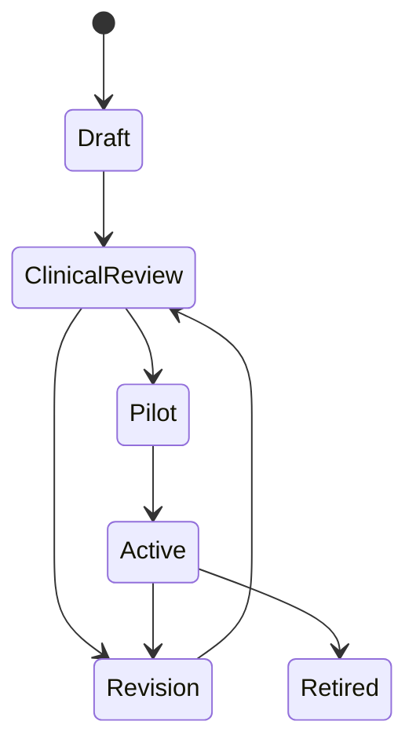

# 04. Clinical Pathway Engine

## 1. 定位

Clinical Pathway Engine 是系统的核心。它把医院的临床路径、护理随访、患者教育、风险规则和任务分派变成可执行配置。

系统不是围绕疾病运行，而是围绕Care Pathway运行。

## 2. Pathway定义

Care Pathway 是一个可版本化的照护执行模板，定义：

- 适用人群。
- 观察项。
- 随访频率。
- 问卷和追问逻辑。
- 患者教育内容。
- 风险规则。
- Alert等级。
- 护士/医生处理流程。
- 复诊前Summary模板。

## 3. Pathway生命周期



| 状态 | 含义 |
|---|---|
| Draft | AI或产品人员生成草案 |
| ClinicalReview | 临床专家审阅 |
| Revision | 修改中 |
| Pilot | 小范围试点 |
| Active | 可正式使用 |
| Retired | 停用 |

## 4. 医生如何创建Pathway

1. 选择从空白创建或复制模板。
2. 填写名称、科室、适用场景。
3. 定义患者纳入和排除条件。
4. 配置Observation。
5. 配置随访问卷和频率。
6. 配置Rule和Alert。
7. 配置患者教育内容。
8. 配置Summary模板。
9. 提交临床审批。
10. 试点后发布。

## 5. AI如何推荐Pathway

Guideline Agent可读取临床指南、药品说明书、院内规范和已有路径，生成Pathway草案。

AI只能生成建议，不可直接上线。

输出内容：

- 建议Observation。
- 随访频率。
- 需要追问的问题。
- 风险规则候选。
- 患者教育候选文本。
- 证据来源。
- 置信度。
- 需要临床确认的问题。

## 6. Pathway配置Schema

建议字段：

```yaml
id: pathway_glp1_v1
name: GLP-1治疗随访路径
department: 内分泌科
version: 1.0.0
status: Draft
population:
  inclusion:
    - 使用GLP-1类药物后的院外随访患者
  exclusion:
    - 未完成随访授权
observations:
  - code: symptom.nausea.severity
    name: 恶心程度
    type: integer
    unit: 0-10
    frequency: daily
rules:
  - id: rule_glp1_vomit_persistent
    severity: L2
    condition: vomiting_days >= 2
summary_template: glp1_pre_visit_v1
approval:
  required: true
```

## 7. Observation配置

每个Observation定义：

| 字段 | 说明 |
|---|---|
| code | 内部编码或标准编码 |
| name | 展示名称 |
| type | number/string/boolean/scale/photo/text |
| unit | 单位 |
| frequency | daily/weekly/custom/event_based |
| source | patient/device/lab/nurse/doctor |
| required | 是否必填 |
| normal_range | 正常范围，可选 |
| alertable | 是否参与规则 |
| extraction_prompt | 从自然语言抽取时的提示 |

## 8. Rule配置

### 8.1 规则类型

| 类型 | 说明 | 示例 |
|---|---|---|
| Threshold Rule | 单次值超过阈值 | 血压高于配置阈值 |
| Trend Rule | 连续变化 | 体重连续下降 |
| Composite Rule | 多项组合 | 发热 + 伤口红肿 |
| Missingness Rule | 数据缺失 | 连续3天未记录 |
| NLP Safety Rule | 患者表达急症 | “胸痛”“喘不过气” |
| Workflow Rule | 工作流超时 | L2 Alert 24小时未处理 |

### 8.2 规则字段

| 字段 | 说明 |
|---|---|
| rule_id | 规则ID |
| name | 规则名称 |
| pathway_id | 所属路径 |
| version | 版本 |
| condition | 条件表达式 |
| severity | L0-L4 |
| action | 创建Alert、通知、追问、任务 |
| evidence_required | 所需证据字段 |
| cooldown | 静默期，避免重复报警 |
| owner_role | 默认责任角色 |
| clinical_approver | 临床审批人 |

## 9. Alert配置

| 等级 | 场景 | 动作 |
|---|---|---|
| L0 | 普通记录 | 进入Timeline |
| L1 | 轻微异常 | Summary中提示 |
| L2 | 护士需查看 | 护士队列，24小时SLA |
| L3 | 医生需关注 | 医生工作台置顶，较短SLA |
| L4 | 急症风险 | 患者急救提示，通知值班，审计锁定 |

## 10. Summary模板配置

每个Pathway可以定义Summary结构：

- 期间概览。
- 关键Observation趋势。
- Alert和处理。
- 患者主要问题。
- 数据缺失。
- 医生待确认事项。
- 证据链。

## 11. 模板库

### 11.1 GLP-1治疗

| 模块 | 配置 |
|---|---|
| Observation | 恶心、呕吐、食欲、进食量、体重、腹痛、便秘/腹泻、低血糖相关症状 |
| Follow-up | 初始阶段每日症状记录，每周体重，复诊前自动汇总 |
| Alert Rule | 持续呕吐、明显脱水表达、严重腹痛、无法进食、体重异常快速变化、连续多日未记录 |
| Communication Strategy | 低负担每日打卡，解释常见反应，异常时联系医院，不做剂量建议 |

### 11.2 高血压

| 模块 | 配置 |
|---|---|
| Observation | 收缩压、舒张压、心率、头痛、胸闷、胸痛、气短、头晕、服药依从性自报 |
| Follow-up | 每日或每周血压记录，复诊前趋势摘要 |
| Alert Rule | 极高血压值、血压升高伴胸痛/神经症状、连续未测量、患者报告自行停药 |
| Communication Strategy | 指导规范记录时间和姿势，提醒按医嘱用药，异常症状进入急症流程，不建议改药 |

### 11.3 术后恢复

| 模块 | 配置 |
|---|---|
| Observation | 疼痛评分、体温、伤口渗液/红肿、活动能力、饮食、排便、睡眠、照片上传 |
| Follow-up | 术后第1/3/7/14天重点随访，复诊前伤口与症状摘要 |
| Alert Rule | 发热、伤口明显异常、疼痛加重、活动能力下降、疑似感染表达、照片异常需人工查看 |
| Communication Strategy | 简短问题加图片上传，教育伤口护理注意事项，异常时护士先看，必要时医生升级 |

## 12. Pathway版本管理

每次修改以下内容必须新版本：

- Observation定义。
- Rule阈值。
- Alert等级。
- 患者教育内容。
- Summary模板。
- 审批人。

患者Enrollment应绑定具体Pathway版本，避免规则变化后无法解释历史Alert。

## 13. Pathway质量指标

- 随访完成率。
- Observation缺失率。
- Alert触发率。
- Alert真实有效率。
- 医生采纳Summary比例。
- 患者满意度。
- 护士处理时长。

