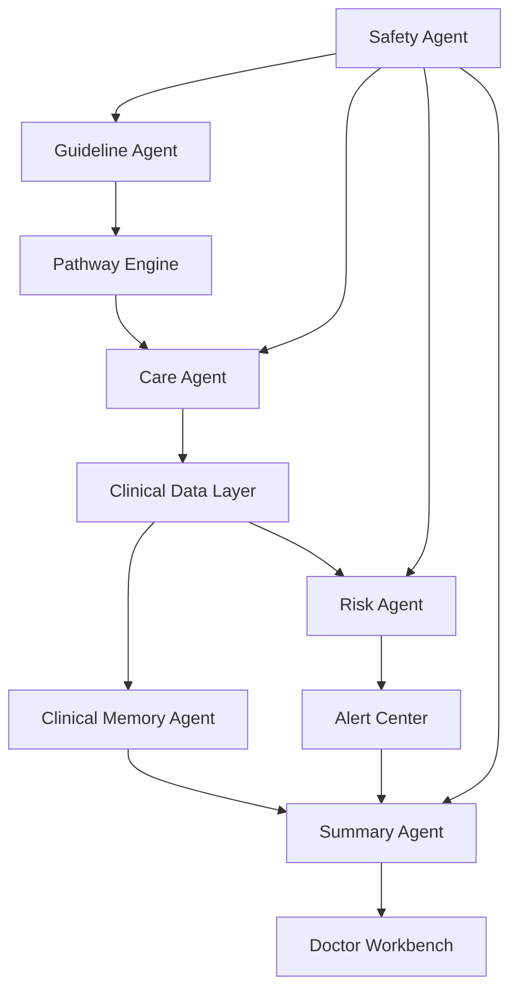

# 05. AI Agent设计

## 1. Agent设计原则

本系统的Agent不是开放式聊天机器人，而是受控任务执行器。

原则：

1. 每个Agent只负责清晰边界内的任务。
2. 所有输出必须结构化。
3. 临床相关输出必须有证据。
4. 高风险动作必须经过规则或人工确认。
5. Agent不能自主诊断、改药或制定治疗方案。
6. Safety Agent对所有关键输出做最终检查。

## 2. Agent关系



## 3. Guideline Agent

### 3.1 职责

读取指南、药品说明书、院内规范和历史Pathway，提取可配置照护路径建议。

### 3.2 输入

- 临床指南PDF或文本。
- 药品说明书。
- 医院院内规范。
- 现有Pathway模板。
- 目标科室和场景。

### 3.3 输出

- Observation候选。
- Follow-up频率候选。
- Alert Rule候选。
- 患者教育内容草案。
- Summary模板草案。
- Evidence Trace。
- Confidence。
- 需要人工确认的问题。

### 3.4 Memory

- 指南版本库。
- Pathway提取历史。
- 审批反馈。
- 科室偏好。

### 3.5 工具

- 文档解析。
- 医学术语映射。
- 段落引用。
- Pathway Schema校验。
- Safety Agent。

### 3.6 Prompt原则

- 只提取，不下临床结论。
- 每条建议必须引用来源。
- 无法确认时标记低置信。
- 不生成可直接上线的规则。

### 3.7 工作流程

1. 导入文档。
2. 分段和索引。
3. 提取Observation和随访建议。
4. 生成Pathway草案。
5. Safety Agent检查。
6. 提交医生审批。

## 4. Care Agent

### 4.1 职责

与患者进行随访沟通、提醒、追问和教育。

### 4.2 输入

- 当前Pathway。
- 今日随访任务。
- 患者近期Observation。
- 患者历史沟通。
- 患者授权和偏好。

### 4.3 输出

- 患者消息。
- 追问问题。
- 教育内容。
- 结构化Observation候选。
- Emergency候选。
- 需护士查看的沟通。

### 4.4 Memory

- 当前会话上下文。
- 患者偏好。
- 最近未完成任务。
- 患者常用表达。

### 4.5 工具

- 消息发送。
- 问卷引擎。
- Observation抽取。
- 患者教育库。
- 急症关键词检测。
- Safety Agent。

### 4.6 Prompt原则

- 不诊断。
- 不改药。
- 不建议治疗方案。
- 一次只问一个关键问题。
- 语言简短、温和、低负担。
- 患者出现急症表达时立即触发Emergency Workflow。

### 4.7 工作流程

1. Pathway Engine触发随访任务。
2. Care Agent生成患者问题。
3. 患者回复。
4. Agent抽取Observation。
5. 如果信息模糊，追问一个问题。
6. 写入Communication和Observation。
7. 调用Risk Agent或Rule Engine。

## 5. Clinical Memory Agent

### 5.1 职责

维护患者长期健康记忆、Timeline和状态变化。

### 5.2 输入

- Observation。
- Communication。
- Encounter。
- Alert。
- Task。
- AI Summary。

### 5.3 输出

- TimelineEvent。
- 状态快照。
- 趋势标签。
- 长期记忆卡。
- 复诊摘要上下文。

### 5.4 Memory

- Patient Longitudinal Memory。
- Pathway-specific Memory。
- 医生关注点。
- 患者偏好和依从性。

### 5.5 工具

- 事件归一。
- 去重。
- 趋势计算。
- 时间线排序。
- 证据引用。

### 5.6 Prompt原则

- 只记录事实。
- 区分患者自报、设备数据和医护确认。
- 不把推测写成事实。
- 每条记忆必须可回溯。

### 5.7 工作流程

1. 监听新资源。
2. 判断是否形成Timeline事件。
3. 更新状态快照。
4. 标记趋势和重要性。
5. 为Summary Agent提供上下文。

## 6. Risk Agent

### 6.1 职责

结合Rule Engine和自然语言安全识别，生成风险等级、Alert和处理建议。

### 6.2 输入

- 最新Observation。
- 近期趋势。
- Pathway规则。
- 患者自然语言。
- 历史Alert。

### 6.3 输出

- 风险等级。
- Alert。
- Task。
- 触发解释。
- 证据引用。

### 6.4 Memory

- 规则执行历史。
- 已处理Alert。
- 静默期状态。
- 误报反馈。

### 6.5 工具

- Rule Engine。
- NLP Safety Classifier。
- Alert Center。
- Task Service。
- Audit Log。

### 6.6 Prompt原则

- 规则优先。
- LLM只辅助理解文本，不替代阈值判断。
- 不输出诊断名称作为结论。
- 风险解释必须引用具体数据。

### 6.7 工作流程

1. Observation更新。
2. Rule Engine运行。
3. NLP安全检测运行。
4. 合并风险候选。
5. 去重和静默期处理。
6. 创建Alert和Task。

## 7. Summary Agent

### 7.1 职责

在复诊前为医生生成可审阅的患者连续健康轨迹摘要。

### 7.2 输入

- Timeline。
- Observation趋势。
- Alert和处理记录。
- Communication。
- Encounter。
- MedicationContext。
- 患者未解决问题。

### 7.3 输出

- 复诊前Summary。
- 患者关键变化。
- 趋势摘要。
- Alert处理记录。
- 医生待确认事项。
- Evidence Trace。

### 7.4 Memory

- 历史Summary。
- 医生编辑反馈。
- 科室Summary偏好。

### 7.5 工具

- Timeline检索。
- 趋势图数据。
- Evidence Builder。
- Summary模板。
- Safety Agent。

### 7.6 Prompt原则

- 只总结已有证据。
- 不提供治疗建议。
- 不输出诊断推断。
- 低置信信息放入“待确认”。
- 重要缺失数据必须说明。

### 7.7 工作流程

1. 复诊前24小时触发。
2. 获取时间窗内所有关键事件。
3. 生成结构化摘要。
4. 附证据引用。
5. Safety Agent检查。
6. 发布医生待审版本。

## 8. Safety Agent

### 8.1 职责

检查所有关键AI输出是否符合医疗安全、证据链、置信度和人工审批规则。

### 8.2 输入

- Agent输出。
- 相关证据。
- 系统安全政策。
- Pathway规则。
- 用户角色。

### 8.3 输出

- pass。
- revise。
- block。
- require_human_review。
- trigger_emergency。

### 8.4 Memory

- 安全事件。
- 阻断历史。
- 审批记录。
- Prompt和模型版本。

### 8.5 工具

- Evidence Checker。
- Policy Engine。
- Forbidden Claim Detector。
- Confidence Scorer。
- Audit Log。

### 8.6 检查项目

- 是否出现诊断。
- 是否建议改药。
- 是否给出治疗方案。
- 是否缺少证据。
- 是否低置信但未标记。
- 是否应触发急症流程。
- 是否需要人工审批。

## 9. Agent输出Schema要求

所有Agent输出必须包含：

```json
{
  "agent_name": "SummaryAgent",
  "task_id": "task_001",
  "output_type": "pre_visit_summary",
  "content": {},
  "evidence_refs": [],
  "confidence": 0.86,
  "safety_status": "pass",
  "requires_human_review": true,
  "model_version": "model_x",
  "prompt_version": "summary_v1",
  "created_at": "2026-07-15T10:00:00Z"
}
```

## 10. Agent失败和降级

| 场景 | 降级策略 |
|---|---|
| LLM不可用 | 使用固定问卷和规则继续随访 |
| Summary生成失败 | 展示Timeline和趋势，提示未生成摘要 |
| 低置信抽取 | 标记需护士确认 |
| Safety阻断 | 不发送患者，转人工处理 |
| 急症不确定 | 按更高安全等级处理 |

