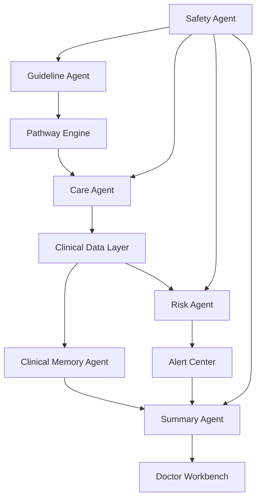

# 05. AI Agent设计

## 0. 实施状态

本节同时描述六 Agent 目标架构和当前实现。六个顶层业务角色没有增加：Care Agent 与 Safety Agent 已进入第三层运行时；第四层已加入确定性 Clinical Memory、双审批 Risk/Task 执行基础设施、证据 Summary/医生审阅、状态快照、原始数值趋势，以及 Doctor Workbench 只读组合查询/证据回放。Summary Agent 现在具有提交配置默认关闭的受控 MiMo 编排能力：模型只能组织动态 Fact Ledger 中已有的事实编号，正文仍由本地代码渲染；该边界已完成 5/5 固定合成用例、64/64 事实的真实 MiMo 验收，包括完整服务、存储和 Provenance。Language Rewriter、Conversation Context Resolver、Temporal Resolver 和 Terminology Resolver 是受控内部能力，不是新的顶层业务 Agent。Guideline Agent 仍属于后续步骤；Risk Agent 没有真实 active 规则，趋势不解释临床意义，受控 Summary 尚未接入旧页面或获真实患者数据使用批准，新 Workbench 也尚未接入真实 IAM/EMR，不能据此宣称临床准确率。

## 1. Agent设计原则

目标系统中的Agent不是开放式聊天机器人，而是受控任务执行器。

原则：

1. 每个Agent只负责清晰边界内的任务。
2. 所有输出必须结构化。
3. 临床相关输出必须有证据。
4. 高风险动作必须经过规则或人工确认。
5. Agent不能自主诊断、改药或制定治疗方案。
6. Safety Agent作为一层风险控制检查关键输出，但不能替代确定性规则、预定义测试和人工审批。

## 2. Agent关系



## 3. Guideline Agent

### 3.1 职责

目标职责是读取指南、药品说明书、院内规范和历史Pathway，提取可配置照护路径建议。

### 3.2 输入

- 临床指南PDF或文本。
- 药品说明书。
- 医院院内规范。
- 现有Pathway模板。
- 目标科室和场景。

### 3.3 输出

- Observation候选。
- Follow-up频率候选。
- Alert Rule候选。
- 患者教育内容草案。
- Summary模板草案。
- Evidence Trace。
- Confidence。
- 需要人工确认的问题。

### 3.4 Memory

- 指南版本库。
- Pathway提取历史。
- 审批反馈。
- 科室偏好。

### 3.5 工具

- 文档解析。
- 医学术语映射。
- 段落引用。
- Pathway Schema校验。
- Safety Agent。

### 3.6 Prompt原则

- 只提取，不下临床结论。
- 每条建议必须引用来源。
- 无法确认时标记低置信。
- 不生成可直接上线的规则。

### 3.7 工作流程

1. 导入文档。
2. 分段和索引。
3. 提取Observation和随访建议。
4. 生成Pathway草案。
5. Safety Agent检查。
6. 提交医生审批。

## 4. Care Agent

### 4.1 职责

目标职责是在已审批Pathway约束下，协助开展随访沟通、提醒、追问和教育。

### 4.2 输入

- 当前Pathway。
- 今日随访任务。
- 患者近期Observation。
- 患者历史沟通。
- 患者授权和偏好。

### 4.3 输出

- 患者消息。
- 追问问题。
- 教育内容。
- 结构化Observation候选。
- Emergency候选。
- 需护士查看的沟通。

### 4.4 Memory

- 当前会话上下文。
- 患者偏好。
- 最近未完成任务。
- 患者常用表达。

### 4.5 工具

- 消息发送。
- 问卷引擎。
- Observation抽取。
- 患者教育库。
- 急症关键词检测。
- Safety Agent。

### 4.6 Prompt原则

- 不诊断。
- 不改药。
- 不建议治疗方案。
- 一次只问一个关键问题。
- 语言简短、温和、低负担。
- 患者出现急症表达时立即触发Emergency Workflow。

### 4.7 工作流程

1. Pathway Engine触发随访任务。
2. Care Agent生成患者问题。
3. 患者回复。
4. Care Agent 先构建 `ConversationContext + TemporalContext`；简短回答只能绑定唯一个已发布的未完成问题，相对时间按患者 IANA 时区解析。
5. Agent 生成 Questionnaire 答案候选和不带 code 的症状检索词，并给出原文证据跨度。
6. Terminology Resolver 对已知字段和新症状统一查询版本化仓库目录；多 code 时追问，未命中时保留原话，不猜代码。
7. Safety Agent 先执行确定性硬规则，再由 MiMo Critic 复核幸存候选和遗漏项；Critic 只能降级，不能恢复硬拒绝。
8. Critic 发现有逐字证据的遗漏时，Care Agent 只对对应的已发布 linkId 定向补抽取；仍不明确则回到 Questionnaire 澄清。
9. Care Agent 内部 Language Rewriter 优化患者措辞；事实锁定失败时保留固定模板。
10. 患者按钮或明确自然语言确认后，已知项进入问卷草稿，新症状进入 `ConfirmedSymptomReport`；提交时统一生成 QuestionnaireResponse/Observation。
11. 后续由经临床批准的 Rule Engine 执行风险工作流；当前保持 not_assessed。

## 5. Clinical Memory Agent

> 当前状态：第四层第 6 步已实现最终资源的确定性 Clinical Memory、current/stale/unknown/conflict 状态快照、单位一致的端点数值方向，以及 Timeline/State/Summary/Task 的 Doctor Workbench 只读组合查询、历史回放、权限隔离、证据图和组件级降级。当前趋势只描述 increasing/decreasing/unchanged，不判断好转、恶化或临床显著性；新读取边界尚未替换旧演示页面。

### 5.1 职责

目标职责是维护患者长期健康记忆、Timeline和状态变化，并保留来源、时间与修订关系。

### 5.2 输入

- Observation。
- Communication。
- Encounter。
- Alert。
- Task。
- AI Summary。

### 5.3 输出

- TimelineEvent。
- 状态快照。
- 趋势标签。
- 长期记忆卡。
- 复诊摘要上下文。

### 5.4 Memory

- Patient Longitudinal Memory。
- Pathway-specific Memory。
- 医生关注点。
- 患者偏好和依从性。

### 5.5 工具

- 事件归一。
- 去重。
- 趋势计算。
- 时间线排序。
- 证据引用。

### 5.6 Prompt原则

- 只记录事实。
- 区分患者自报、设备数据和医护确认。
- 不把推测写成事实。
- 每条记忆必须可回溯。

### 5.7 工作流程

1. 监听新资源。
2. 判断是否形成Timeline事件。
3. 更新状态快照。
4. 标记趋势和重要性。
5. 为Summary Agent提供上下文。

## 6. Risk Agent

> 当前状态：第四层第 3 步已实现双审批 active 规则装载门、final Observation 的确定性条件评估、EvidenceReference、Task 去重和受审计状态转换。仓库没有 active 临床规则，旧产品流程仍固定返回 `not_assessed`；风险等级、Alert 和急症工作流尚未启用。

### 6.1 职责

目标职责是结合Rule Engine和自然语言安全识别，生成待工作流处理的风险候选、Alert和Task；关键等级由经临床审批的规则确定。

### 6.2 输入

- 最新Observation。
- 近期趋势。
- Pathway规则。
- 患者自然语言。
- 历史Alert。

### 6.3 输出

- 风险等级。
- Alert。
- Task。
- 触发解释。
- 证据引用。

### 6.4 Memory

- 规则执行历史。
- 已处理Alert。
- 静默期状态。
- 误报反馈。

### 6.5 工具

- Rule Engine。
- NLP Safety Classifier。
- Alert Center。
- Task Service。
- Audit Log。

### 6.6 Prompt原则

- 规则优先。
- LLM只辅助理解文本，不替代阈值判断。
- 不输出诊断名称作为结论。
- 风险解释必须引用具体数据。

### 6.7 工作流程

1. Observation更新。
2. Rule Engine运行。
3. NLP安全检测运行。
4. 合并风险候选。
5. 去重和静默期处理。
6. 创建Alert和Task。

## 7. Summary Agent

> 当前状态：第四层第 4 步的确定性证据简报与医生审阅保持不变；后续增强项已加入动态 Fact Ledger 和默认关闭的受控 MiMo Outline。模型不能写正文，只能在本地门禁下组织已有 fact ID。趋势临床解释、页面接入和正式病历写回尚未启用。

### 7.1 职责

目标职责是在复诊前为医生生成可审阅的患者连续健康轨迹摘要草稿。

### 7.2 输入

- Timeline。
- Observation趋势。
- Alert和处理记录。
- Communication。
- Encounter。
- MedicationContext。
- 患者未解决问题。

### 7.3 输出

- 复诊前Summary。
- 患者关键变化。
- 趋势摘要。
- Alert处理记录。
- 医生待确认事项。
- Evidence Trace。

### 7.4 Memory

- 历史Summary。
- 医生编辑反馈。
- 科室Summary偏好。

### 7.5 工具

- Timeline检索。
- 趋势图数据。
- Evidence Builder。
- Summary模板。
- Safety Agent。

### 7.6 Prompt原则

- 只总结已有证据。
- 不提供治疗建议。
- 不输出诊断推断。
- 低置信信息放入“待确认”。
- 重要缺失数据必须说明。

### 7.7 工作流程

1. 复诊前24小时触发。
2. 获取时间窗内 Timeline 和最新的版本化状态快照。
3. 把任意数量的事件、指标状态和原始趋势确定性转换为 Fact Ledger。
4. 可选 LLM 只返回 fact ID 的分组/顺序；本地检查未知、遗漏、重复、跨栏目和长度违规。
5. 本地使用 canonical text 和 EvidenceReference 渲染；失败时使用完整事实确定性回退。
6. 保存模型/Prompt/Agent 或回退版本、Provenance，发布医生待审版本。

## 8. Safety Agent

### 8.1 职责

目标职责是检查关键AI输出是否满足证据链、边界表达和人工审批要求。该检查用于降低风险，不构成对输出正确性的保证。

当前第三层实现采用两道门：第一道是不可被 LLM 覆盖的确定性硬规则；第二道是 MiMo Safety Critic 的语义复核与遗漏检查。Safety Agent v4 额外校验简短回答的 `context_binding` 必须精确对应唯一未完成问题。Critic 不拥有数据库/FHIR 工具，不能恢复已拒绝候选，也不能把普通历史描述升级为系统级注入阻断。

### 8.2 输入

- Agent输出。
- 相关证据。
- 系统安全政策。
- Pathway规则。
- 用户角色。

### 8.3 输出

- pass。
- revise。
- block。
- require_human_review。
- trigger_emergency。

### 8.4 Memory

- 安全事件。
- 阻断历史。
- 审批记录。
- Prompt和模型版本。

### 8.5 工具

- Evidence Checker。
- Policy Engine。
- Forbidden Claim Detector。
- Confidence Scorer。
- Audit Log。

### 8.6 检查项目

- 是否出现诊断。
- 是否建议改药。
- 是否给出治疗方案。
- 是否缺少证据。
- 是否低置信但未标记。
- 是否应触发急症流程。
- 是否需要人工审批。

当前第三层尚不执行风险分级、Alert、Task 或 Emergency Workflow；相关项目只是六 Agent 目标架构，必须在第四层接入经医院批准的固定规则后实现。

## 9. Agent输出Schema要求

所有Agent输出必须包含：

```json
{
  "agent_name": "SummaryAgent",
  "task_id": "task_001",
  "output_type": "pre_visit_summary",
  "content": {},
  "evidence_refs": [],
  "confidence_tier": "needs_human_review",
  "safety_status": "pass",
  "requires_human_review": true,
  "model_version": "model_x",
  "prompt_version": "summary_v1",
  "created_at": "2026-07-15T10:00:00Z"
}
```

## 10. Agent失败和降级

| 场景 | 降级策略 |
|---|---|
| LLM不可用 | 使用固定问卷和规则继续随访 |
| Summary生成失败 | 展示Timeline和趋势，提示未生成摘要 |
| 低置信抽取 | 标记需护士确认 |
| Safety阻断 | 不发送患者，转人工处理 |
| 急症表达不确定 | 进入固定安全提示和人工复核流程，不由模型自行给出临床结论 |
