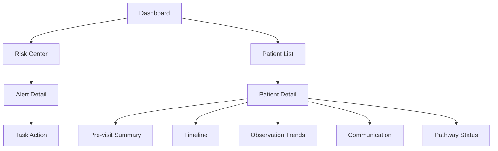

# 07. 医生工作台与患者端设计

> **治理提示：** 本文含目标态页面示例。当前患者端已由版本锁定的 FHIR Questionnaire 动态驱动，保存 QuestionnaireResponse、确定性映射有标准依据的 Observation，并明确显示“未评估”；旧 L2/L4 页面文案不代表现行功能。

## 1. 设计原则

界面采用克制、清晰、可扫描的医院工作台风格，优先支持医生和护士在有限时间内定位待审信息、证据和责任任务。

## 2. 信息架构



## 3. 医生Dashboard

### 3.1 目标

让医生在进入系统后立即知道：

- 今天哪些患者要复诊。
- 哪些患者有高风险。
- 哪些Summary需要审阅。
- 哪些Alert需要医生处理。

### 3.2 核心组件

- 今日复诊患者列表。
- 高风险患者列表。
- 待审Summary。
- 未处理L3/L4 Alert。
- Pathway执行概览。

### 3.3 卡片字段

患者卡片展示：

- 姓名/年龄/性别。
- 当前Pathway。
- 复诊时间。
- 风险等级。
- 最近关键变化。
- 未处理Alert数量。

## 4. 护士Risk Center

### 4.1 目标

将院外异常从散落消息变成可分派、可处理、可追踪的任务队列。

### 4.2 筛选维度

- 风险等级。
- 科室。
- Pathway。
- SLA状态。
- 责任人。
- Alert类型。
- 复诊日期。

### 4.3 Alert详情

必须展示：

- Alert等级。
- 触发原因。
- 规则ID和版本。
- 证据。
- 患者最近沟通。
- 建议处理角色。
- SLA倒计时。
- 处理按钮：确认、联系患者、升级医生、关闭。

## 5. Patient Detail

### 5.1 顶部信息

- 患者基本信息。
- 当前Pathway。
- 最近Encounter。
- 下次复诊。
- 当前风险等级。
- 数据更新时间。

### 5.2 核心区域

建议分为六个Tab：

1. Summary。
2. Timeline。
3. Trends。
4. Alerts。
5. Communication。
6. Pathway。

## 6. Pre-visit Summary

### 6.1 摘要结构

1. 状态概览。
2. 关键变化。
3. Observation趋势。
4. Alert和处理。
5. 患者关注问题。
6. 数据缺失。
7. 医生待确认事项。
8. Evidence Trace。

### 6.2 合成数据示例

以下内容仅用于展示目标摘要结构，不代表真实患者记录或临床效果：

```text
过去14天患者完成11/14次随访。主要问题为前3天轻中度恶心，随后减轻。第6天报告一次呕吐，未持续。体重从82.4kg下降至81.1kg。无未处理L3/L4 Alert。患者复诊前主要问题是担心恶心是否会持续。
```

目标系统要求每句话均可点击查看证据；当前原型已实现核心摘要条目的证据引用展示。

## 7. Timeline

### 7.1 目标

帮助医生快速恢复“上次见面后发生了什么”。

### 7.2 事件类型

- Encounter。
- Observation。
- 患者主动消息。
- AI追问。
- Alert。
- 护士电话。
- 医生确认。
- Summary生成。

### 7.3 视觉优先级

- L4/L3事件高亮。
- 人工处理记录高亮。
- 普通每日打卡折叠。
- 数据缺失用轻量提示。

## 8. Observation Trends

### 8.1 展示对象

- 体重。
- 血压。
- 疼痛评分。
- 恶心评分。
- 体温。
- 活动能力。
- 服药依从性自报。

### 8.2 交互

- 时间范围切换。
- 点击点位查看原始记录。
- 标记患者自报或设备来源。
- 趋势标签：改善、恶化、波动、缺失。

## 9. AI Copilot面板

### 9.1 计划支持的查询类型

- “患者这两周主要变化是什么？”
- “哪些Alert还没处理？”
- “哪些信息来自患者自报？”
- “这个Alert为什么触发？”
- “患者复诊前有什么问题？”

### 9.2 明确禁止的查询类型

- “应该怎么治疗？”
- “要不要加药？”
- “患者是什么诊断？”
- “能不能不用复诊？”

### 9.3 拒答方式

AI应简短说明边界，并引导医生查看证据或自行判断。

## 10. 患者端

### 10.1 设计目标

患者端定位为诊后随访和信息记录工具，不承担开放式问诊、诊断或治疗建议。

### 10.2 核心功能

| 功能 | 描述 |
|---|---|
| 聊天随访 | 按Pathway自动提问 |
| 每日记录 | 症状、体征、量表、图片 |
| 提醒 | 用药提醒、测量提醒、复诊提醒 |
| 教育 | 已审批内容，短文本优先 |
| 进度 | 显示已完成记录和复诊倒计时 |
| 异常提示 | 危急情况直接就医，不等待AI |

## 11. 患者端聊天策略

### 11.1 语言风格

- 温和。
- 简短。
- 一次一个问题。
- 避免专业术语。
- 不制造焦虑。

### 11.2 示例

```text
今天想了解一下你的用药后反应。过去24小时你有没有恶心？可以回复：没有、轻微、中等、严重。
```

如果患者回答“有点难受，吃不下”：

```text
收到。为了帮医生了解变化，我想再确认一个问题：过去24小时你有没有呕吐？
```

## 12. 患者端安全提示

固定展示：

```text
本系统用于院后随访和信息记录，不能替代医生诊疗。如果出现严重不适、胸痛、呼吸困难、意识异常、大量出血等紧急情况，请立即联系急救或前往急诊。
```

## 13. 页面优先级

### 当前比赛原型优先覆盖

1. 医生Dashboard。
2. Patient Detail。
3. Timeline。
4. Summary。
5. Risk Center。
6. 患者聊天页。

### 后续医院版本计划覆盖

- 管理后台。
- 复杂权限。
- Pathway Studio完整编辑器。
- 批量患者运营看板。
