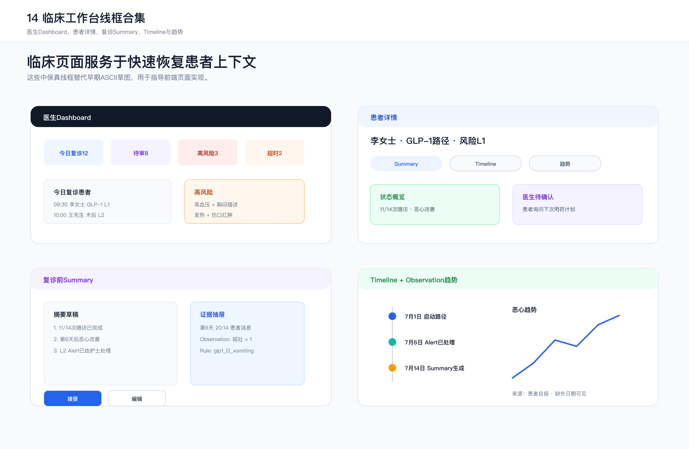
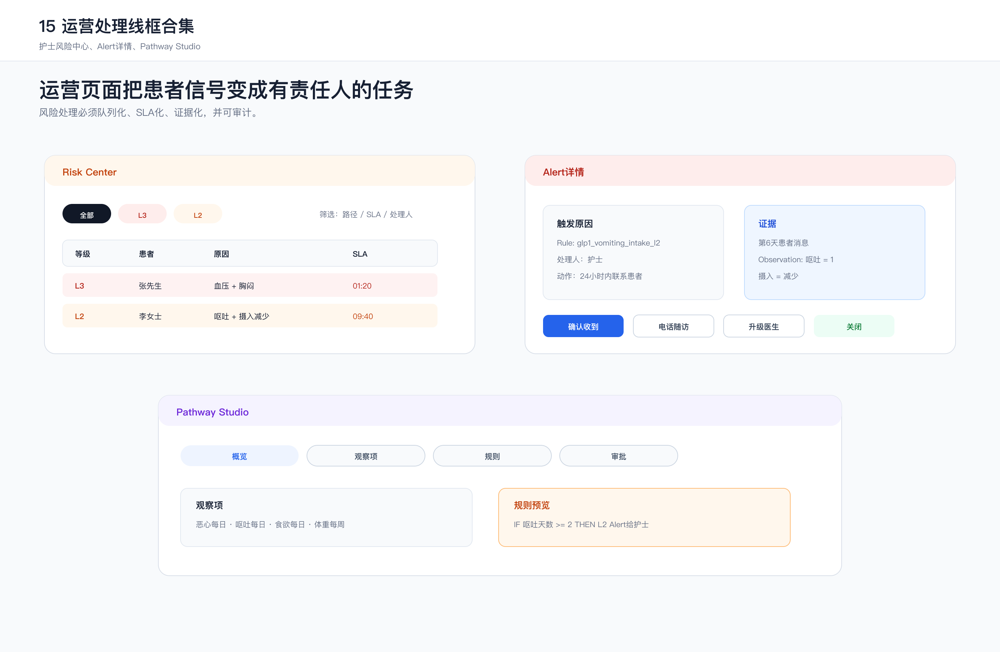
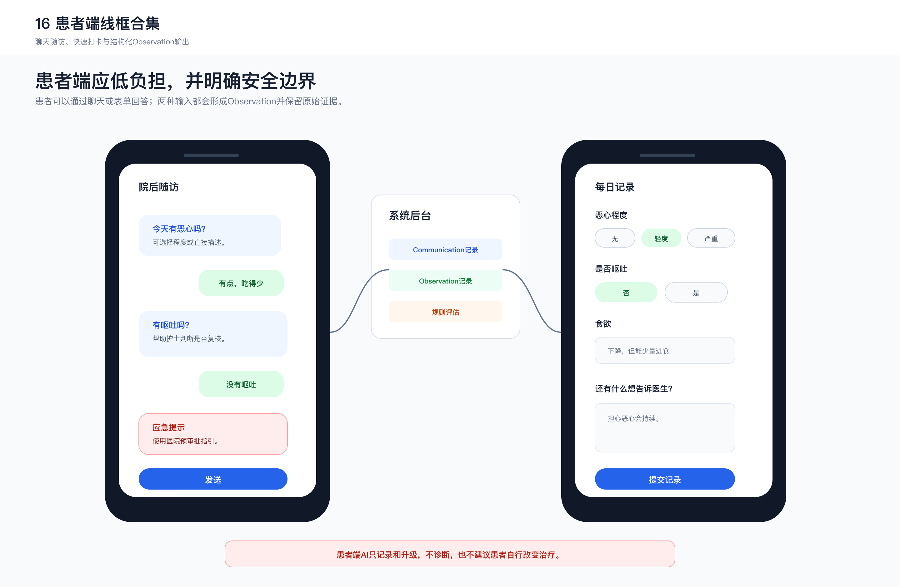

# 11. 图表与中保真线框图

> **治理提示：** 旧线框图中的 L0–L4 为历史目标态占位，不是当前临床逻辑。现行患者端状态为 `not_assessed`，直到规则完成临床审批。

## 1. 当前图表清单

本节汇总目标系统的架构图、时序图和中保真线框图，便于核对业务闭环、角色责任与页面信息结构。

| 图表 | 文件 | 作用 |
|---|---|---|
| 总体系统架构图 | [02_system_architecture.md](02_system_architecture.md) | 患者端、Pathway、Agent、规则、医生工作台和集成层关系 |
| Pathway配置时序图 | [02_system_architecture.md](02_system_architecture.md) | AI建议、临床审批、安全审查和发布边界 |
| 随访数据流时序图 | [02_system_architecture.md](02_system_architecture.md) | 患者回复如何变成Observation并触发规则 |
| 复诊摘要时序图 | [02_system_architecture.md](02_system_architecture.md) | Summary生成、安全检查和医生审阅 |
| FHIR风格ER图 | [03_data_model_fhir.md](03_data_model_fhir.md) | Patient、Observation、Communication、Alert、Timeline、Summary关系 |
| Pathway配置引擎图 | [04_pathway_engine.md](04_pathway_engine.md) | 从路径创建到运行态对象的配置闭环 |
| Pathway生命周期图 | [04_pathway_engine.md](04_pathway_engine.md) | Draft、Clinical Review、Pilot、Active、Retired状态 |
| Agent关系图 | [05_ai_agents.md](05_ai_agents.md) | Guideline、Care、Memory、Risk、Summary、Safety Agent协作 |
| 安全与应急工作流 | [06_safety_and_governance.md](06_safety_and_governance.md) | 规则、置信度、证据链和人工审批边界 |
| 页面信息架构图 | [07_workbench_and_patient_app.md](07_workbench_and_patient_app.md) | Dashboard、Patient Detail、Risk Center等页面关系 |
| 医生工作台图 | [07_workbench_and_patient_app.md](07_workbench_and_patient_app.md) | 风险中心、患者时间线与复诊摘要的页面逻辑 |
| 患者端随访图 | [07_workbench_and_patient_app.md](07_workbench_and_patient_app.md) | 提醒、动态追问、教育与结构化Observation输出 |
| 完整业务流程图 | [08_demo_script.md](08_demo_script.md) | 从出院到复诊前Summary的人机协同闭环 |
| 临床工作台线框合集 | 本文档 | Dashboard、Patient Detail、Summary、Timeline与Trends |
| 运营处理线框合集 | 本文档 | Risk Center、Alert Detail与Pathway Studio |
| 患者端线框合集 | 本文档 | 聊天随访、快速打卡与结构化Observation输出 |

## 2. Figwright线框图

### 2.1 临床工作台

覆盖页面：

- Doctor Dashboard。
- Patient Detail。
- Pre-visit Summary。
- Timeline。
- Observation Trends。

核心设计目标：支持医生在有限时间内恢复患者诊后的上下文，并明确哪些信息需要自己审阅；“30秒”作为后续可用性测试目标，不作为当前已验证结果。

### 2.2 运营处理

覆盖页面：

- Risk Center。
- Alert Detail。
- Pathway Studio。

核心设计目标：护士和医生处理的是可追踪任务，而不是散落消息；每个Alert都必须有触发原因、证据、处理人、SLA和关闭记录。

### 2.3 患者端

覆盖页面：

- Patient Chat。
- Patient Daily Check-in。
- Observation生成链路。

核心设计目标：患者端低负担、短路径、明确安全边界。患者可以聊天，也可以快速打卡；两种输入都会进入结构化Observation和Communication记录。

## 3. 页面规格摘要

### 3.1 Doctor Dashboard

优先展示：

- 今日复诊患者。
- 待审Summary。
- L3/L4高风险患者。
- 超时任务。
- Pathway执行概览。

关键交互：

- 点击患者卡片进入Patient Detail。
- 点击高风险卡片进入Alert Detail。
- 点击待审Summary进入Pre-visit Summary。

### 3.2 Patient Detail

核心区域：

- 状态概览。
- 当前主要问题。
- Summary入口。
- Timeline入口。
- Trend入口。
- Communication入口。
- Pathway状态入口。

关键原则：

- Summary中的每条结论必须可点击展开Evidence Trace。
- 风险等级点击后进入Alert列表。
- Pathway标签点击后查看当前随访规则。

### 3.3 Pre-visit Summary

摘要结构：

1. 状态概览。
2. 关键变化。
3. Observation趋势。
4. Alert和处理。
5. 患者关注问题。
6. 数据缺失。
7. 医生待确认事项。
8. Evidence Trace。

关键原则：

- Summary正文只放已证实信息。
- 低置信内容进入“医生待确认”。
- 默认不写回EMR，必须医生点击确认。

### 3.4 Risk Center

表格字段：

- Severity。
- Patient。
- Pathway。
- Reason。
- SLA。
- Owner。
- Status。

关键交互：

- 点击行进入Alert Detail。
- 支持批量分配L1/L2任务。
- L3/L4必须人工确认处理。

### 3.5 Alert Detail

必须展示：

- Trigger Rule。
- Rule Version。
- Evidence。
- Related Observations。
- Recommended workflow action。
- Resolution note。
- Audit trail。

处理动作：

- Acknowledge。
- Call patient。
- Escalate to doctor。
- Resolve。

### 3.6 Pathway Studio

核心Tab：

- Overview。
- Observations。
- Questionnaire。
- Rules。
- Education。
- Approval。

关键原则：

- AI只能生成草案。
- 临床审核通过后才可发布Active版本。
- 已发布Pathway必须版本化，不允许静默修改运行中规则。

### 3.7 Patient Chat

交互原则：

- 温和。
- 简短。
- 一次一个问题。
- 避免专业术语。
- 不制造焦虑。
- 明确说明AI只做随访记录，不做诊断治疗。

### 3.8 Patient Daily Check-in

核心字段：

- 恶心程度。
- 是否呕吐。
- 食欲。
- 体重。
- 自由文本。

安全提示必须固定展示：本系统用于院后随访和信息记录，不能替代医生诊疗。如出现严重不适、胸痛、呼吸困难、意识异常、大量出血等紧急情况，应立即联系急救或前往急诊。

## 4. 设计系统方向

### 4.1 工作台风格

- 安静、专业、信息密度适中。
- 减少装饰，强调可扫描。
- 风险等级使用稳定色彩，不使用夸张渐变。
- 重要信息优先，营销式大标题不进入工作台。

### 4.2 风险色彩建议

| 等级 | 颜色语义 |
|---|---|
| L0 | 中性灰 |
| L1 | 蓝或青色 |
| L2 | 黄色 |
| L3 | 橙色 |
| L4 | 红色 |

### 4.3 组件优先级

- 表格：Risk Center、患者列表。
- Timeline：患者轨迹。
- Evidence Drawer：证据链侧边栏。
- Status Badge：风险、审批、Summary状态。
- Trend Chart：Observation变化。
- Task Actions：处理、升级、关闭。

## 5. 交互验证优先级

第一阶段优先验证以下可点击工作流：

1. Doctor Dashboard -> Patient Detail。
2. Patient Detail -> Summary -> Evidence Trace。
3. Risk Center -> Alert Detail -> Resolve。
4. Patient Chat -> Observation生成。
5. Pathway Studio -> Rule配置 -> Approval。

第一版交互原型用于核对角色、状态、证据和任务是否形成完整链路；是否适用于真实医院工作流，仍需在试点中验证。
