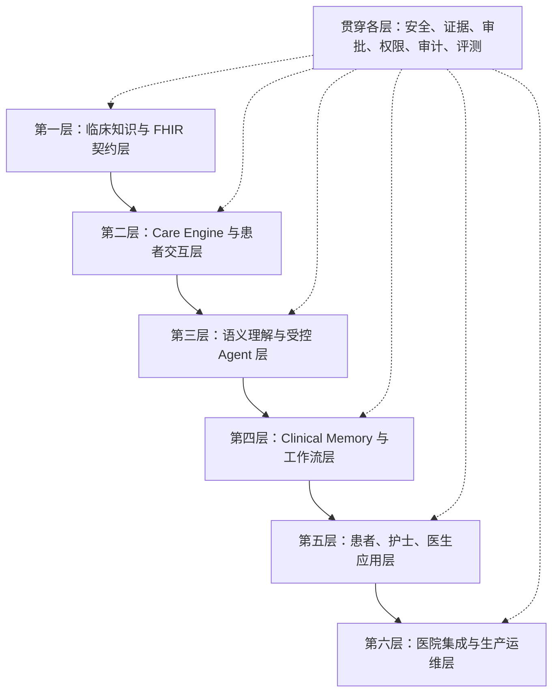
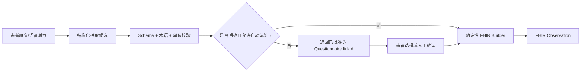
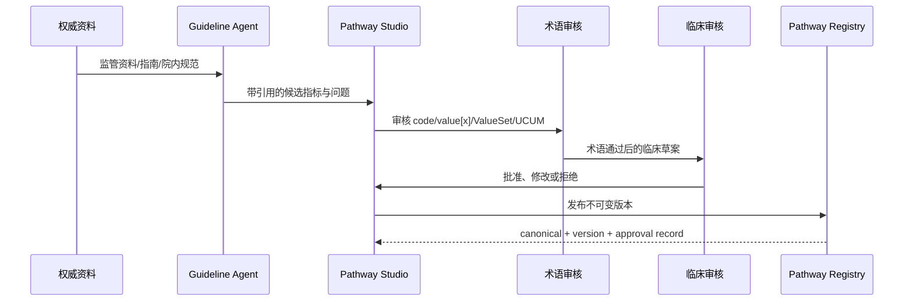
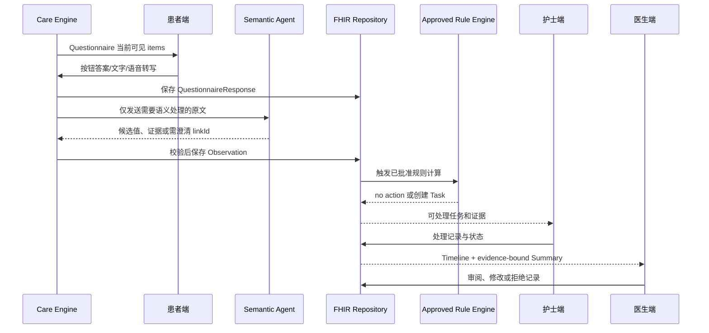

# 14. ContinuCare 分层方案与端到端交付工作流

- 版本：1.0.0（2026-07-31）
- 状态：工程设计基线
- 适用范围：比赛原型、后续单科室试点和医院落地规划

## 1. 文档目的

本文件把 ContinuCare 从“患者端页面”还原为一套完整、可逐层建设的连续照护系统。它回答四个核心问题：

1. 前端、后端、Agent、临床知识和医院系统分别负责什么；
2. 患者自然语言如何成为有来源、可验证的临床数据；
3. 动态问题和按钮由谁生成，如何避免模型临时编造；
4. 每一层做到什么程度后，下一层才可以安全开始。

本文中的“已实现”只指当前仓库内可运行、可测试的合成数据原型。“目标态”不等于已完成临床验证或医院认证。

## 2. 总体分层



这里的依赖关系不是“上一层全部做完才能写下一层代码”，而是“下层不能绕过上层契约”。例如患者端可以提前开发，但它必须消费第一层发布的 Questionnaire，不能在前端硬编码另一套临床问题。

## 3. 第一层：临床知识与 FHIR 契约层

### 3.1 目标

把指南、监管资料、院内规范和临床人员的决策，整理为机器可读、版本化、可审批的路径契约。它是后续页面、Agent、工作流和数据存储的唯一临床事实来源。

### 3.2 核心内容

| 内容 | 标准或项目载体 | 职责 |
|---|---|---|
| 路径治理清单 | `PathwayDefinition` | 管理版本、状态、适用范围、信源和审批 |
| 患者问题集 | FHIR R4 `Questionnaire` | 定义问题、类型、选项、启用条件和说明 |
| 患者某次回答 | FHIR R4 `QuestionnaireResponse` | 保存患者实际回答和时间、主体、作者、来源 |
| 标准化临床事实 | FHIR R4 `Observation` | 保存点时或时间窗内的患者报告事实 |
| 路径动作定义 | FHIR R4 `PlanDefinition` | 定义可复用的采集或照护动作 |
| 临床与术语依据 | Evidence Pack | 解释为什么采集、使用什么编码、不能推导什么 |
| 临床规则 | 版本化规则清单 | 只有证据、审批和测试齐全后才允许启用 |

### 3.3 动态按钮的来源

患者端按钮不应由大模型临时生成。标准流程是：

```text
Questionnaire.item.type = boolean
→ 前端渲染“是 / 否”

Questionnaire.item.type = choice
Questionnaire.item.answerOption = [...]
→ 前端按 answerOption 渲染按钮

Questionnaire.item.enableWhen = 条件
→ 前端或 Care Engine 在条件成立时显示后续问题
```

模型可以根据患者自由文本建议“哪个已批准问题还需要确认”，但只能返回 Questionnaire 中已有的 `linkId`。模型不能新增按钮文字、临床量表或升级阈值。

### 3.4 第一层输出契约

第一层发布一个不可随意修改的版本包：

- Pathway code 与 version；
- Questionnaire canonical 与 version；
- PlanDefinition canonical 与 version；
- 允许使用的 LOINC、SNOMED CT、UCUM 和 ValueSet；
- Observation 的 `code`、`value[x]`、时间语义和来源要求；
- Evidence Pack 与来源版本；
- 临床与术语审批状态；
- 已批准规则列表；没有规则时必须是空列表。

### 3.5 当前实现状态

当前已建立 `GLP1-14D v1.0.0` 基线，包括 FHIR R4 Questionnaire、PlanDefinition、QuestionnaireResponse、Observation、术语常量、来源追溯、完整 JSON 持久化和 fail-closed 治理。当前仍为 `draft / synthetic_only / not_reviewed`，且 `clinical_rules=[]`。

第一层的详细验收结论见 [15_layer_1_acceptance.md](15_layer_1_acceptance.md)。

## 4. 第二层：Care Engine 与患者交互层

### 4.1 目标

把第一层的静态路径契约变成一次真实的随访过程：在正确时间向正确患者展示正确问题，保存每次回答，并管理尚未回答或需要澄清的状态。

### 4.2 后端职责

- 根据 Enrollment 选择确定的 Pathway 版本；
- 读取 Questionnaire，而不是复制问题文案；
- 计算当前可见、已完成、待回答和被 `enableWhen` 禁用的问题；
- 接收按钮、数字、数量、文字或语音转写结果；
- 构造并校验 QuestionnaireResponse；
- 保存随访会话状态、超时和重复提交；
- 把自由文本交给第三层处理；
- 把结构化按钮答案直接交给确定性映射器。

### 4.3 前端职责

前端是 Questionnaire renderer，不是临床规则引擎。

| Questionnaire 类型 | 推荐控件 |
|---|---|
| `boolean` | 两个单选按钮 |
| `choice` | `answerOption` 按钮或单选列表 |
| `integer` / `decimal` | 数字输入 |
| `quantity` | 数值 + 受控单位 |
| `text` / `string` | 文本输入框 |
| 语音入口 | 转写为文本，同时保留音频或转写来源元数据 |

前端不得自行决定 Observation code、风险等级或医护 SLA。它只显示后端返回的受控内容，并把患者实际选择原样提交。

### 4.4 第二层输出

- 完整 QuestionnaireResponse；
- 当前会话状态；
- 未回答或需要澄清的 `linkId`；
- 原始文字/语音转写；
- 交给第三层的受控语义理解任务。

## 5. 第三层：语义理解与受控 Agent 层

### 5.1 目标

处理按钮无法覆盖的患者自然语言，例如“今天有点难受，水也喝不下多少”。Agent 的任务是理解、定位证据和提出澄清需求，不是做诊断或临床分级。

### 5.2 处理流程



### 5.3 Agent 输出契约

Agent 不能直接向数据库写任意 FHIR JSON。它只能输出受限候选：

- 目标 Questionnaire `linkId` 或允许的 Observation concept；
- 候选值与单位；
- 原文证据和字符位置；
- 否定、既往、时间窗和主体信息；
- 置信层级；
- `needs_clarification` 与原因。

随后由确定性代码完成术语白名单、值类型、时间语义、FHIR 构造和持久化校验。

### 5.4 何时生成追问

只有以下情况可以追问：

- 第一层 Questionnaire 已经定义对应问题；
- 当前 `enableWhen` 满足；
- 当前回答缺失、冲突或不足以形成标准事实；
- 追问不会越过诊断、治疗和用药边界。

例如“喝水少”不能直接生成 `Fluid intake 24 hour Estimated` 数值 Observation。Care Engine 应展示已批准的定量问题，请患者填写毫升数；无法确认时只保留原文。

## 6. 第四层：Clinical Memory 与工作流层

### 6.1 目标

把一次次患者回答组织成可回溯的纵向事实，并在有已批准规则时创建医护工作任务。

### 6.2 Clinical Memory

Clinical Memory 不是聊天记录的摘要，而是带来源图谱的长期数据：

- QuestionnaireResponse：患者实际说了什么；
- Observation：标准化事实；
- Provenance：谁或什么系统产生、审核、修改了资源；
- Timeline：按临床有效时间而非仅按写入时间组织；
- 修订关系：`preliminary → final → amended/corrected/entered-in-error`；
- 数据缺失和冲突：不能被摘要自动抹平。

### 6.3 规则与任务

目标医院版本应优先使用 FHIR 资源表达可交换工作流：

| 业务含义 | 目标 FHIR 表达 |
|---|---|
| 经批准的路径动作 | `PlanDefinition` / `CarePlan` |
| 待医护处理事项 | `Task` |
| 患者或医护沟通 | `Communication` / `CommunicationRequest` |
| 可交换的临床问题 | 按场景评估 `DetectedIssue` 或其他目标 Profile |
| 资源产生和审核 | `Provenance` |
| 安全审计 | `AuditEvent` |

内部队列可以保留检索投影，但不得用自定义数据库表替代对外 FHIR 资源契约。

### 6.4 Fail-closed

如果规则没有适用人群、证据章节、版本、审批人、测试集和回退方案，系统可以保存 QuestionnaireResponse 和 Observation，但必须返回 `not_assessed`，不得创建风险等级、临床报警或处置建议。

## 7. 第五层：角色应用层

### 7.1 患者端

- 显示 Questionnaire 驱动的问题和按钮；
- 保留文字与语音入口；
- 让患者确认系统记录了什么；
- 允许更正或撤回；
- 明确非诊断、非急救通道和隐私边界。

### 7.2 护士端

- 只展示已批准规则产生的 Task；
- 展示规则版本、触发条件和原始证据；
- 支持确认、分派、升级、记录处理和关闭；
- 不把 Agent 生成文本当成临床结论。

### 7.3 医生端

- 展示复诊前证据简报、Timeline、趋势和缺失数据；
- 每条摘要可返回 QuestionnaireResponse、Observation 和医护动作；
- 支持接受、修改、拒绝和审阅留痕；
- 默认不自动写入正式病历。

### 7.4 Pathway Studio

- 导入权威资料并生成带引用的草案；
- 配置 Questionnaire、术语、规则和摘要模板；
- 管理临床与术语双审批；
- 发布不可变版本，变更时创建新版本；
- 查看试点指标和回退状态。

## 8. 第六层：医院集成与生产运维层

### 8.1 医院数据与身份

- 通过目标 FHIR API、HL7 v2 或院内接口读取 Patient、Encounter、Medication 和 Appointment；
- 建立本系统患者 ID 与医院主索引的映射；
- 使用医院 SSO、OAuth 2.0/SMART on FHIR 或批准的等效机制；
- 遵循最小权限、患者授权和撤回机制。

### 8.2 标准化交付物

- 目标 Implementation Guide；
- StructureDefinition、ValueSet、CodeSystem、SearchParameter；
- CapabilityStatement；
- 术语服务器 `$validate-code`；
- FHIR Validator CI；
- API 安全、错误处理、幂等、分页和版本策略。

### 8.3 生产运维

- 加密、密钥管理、备份和灾备；
- 结构化审计与安全事件响应；
- 模型、Prompt、术语、Pathway 和规则版本追踪；
- 延迟、失败率、重复消息、任务积压和数据质量监控；
- 回归评测、影子模式、灰度发布和一键停用规则；
- 真实患者数据不得进入开发日志、演示数据库或未经批准的模型环境。

## 9. 贯穿各层的安全治理

任何临床相关能力都必须同时回答：

1. 来源是什么，版本是什么；
2. 适用于哪种药物、人群、地区和时间窗；
3. 原始证据在哪里；
4. 是患者自报、模型候选还是医护确认；
5. 谁批准了问题、编码、规则和患者文案；
6. 如果模型或外部服务不可用，系统如何降级；
7. 如果发现错误，如何更正、撤回和审计。

Safety Agent 只能作为附加检查，不能替代 FHIR 校验、术语服务、确定性规则、测试和临床人工审批。

## 10. 两条完整工作流

### 10.1 Pathway 制作与发布



没有双重审批时只能保持 Draft，不得进入真实患者 Enrollment。

### 10.2 患者随访到医生复诊



## 11. 前后端与 Agent 的责任边界

| 决策 | 前端 | 后端/Care Engine | Agent | 临床/术语治理 |
|---|---:|---:|---:|---:|
| 显示哪个已发布问题 | 渲染 | 决定当前状态 | 可建议待澄清 `linkId` | 定义问题 |
| 按钮文字和选项 | 不修改 | 下发 | 不得发明 | 审批并发布 |
| 保存原始回答 | 提交 | 构造 QR | 不负责 | 定义契约 |
| 从自由文本抽取候选 | 不负责 | 编排 | 负责候选与证据 | 定义白名单 |
| 创建 FHIR Observation | 不负责 | 确定性构造和校验 | 不直接写入 | 定义 Profile/术语 |
| 风险等级和任务 | 只显示 | 执行已批准规则 | 不决定阈值 | 审批规则 |
| 医疗决策 | 不负责 | 不负责 | 禁止 | 医护人员负责 |

## 12. 建设顺序

### Milestone 1：第一层工程基线

- FHIR R4 资源、术语、证据、版本和审批门禁；
- 完整资源持久化、来源追溯和自动校验；
- 未获批规则 fail-closed。

### Milestone 2：Questionnaire 驱动的患者端

- 通用 Questionnaire renderer；
- 结构化 QuestionnaireResponse builder；
- `answerOption`、`enableWhen`、必填项和修改流程；
- 文字与语音入口。

### Milestone 3：受控语义理解

- Schema-constrained extraction；
- 否定、既往、时间窗、主体和证据位置；
- 澄清问题选择；
- 人工确认和模型评测集。

### Milestone 4：Clinical Memory 与医护工作流

- Timeline、Provenance、修订和去重；
- 经审批规则、Task 和责任闭环；
- 证据化 Summary 和医生审阅。

### Milestone 5：医院试点

- 目标 IG/Profile/术语服务器；
- 身份、授权、FHIR API 和旁路集成；
- 影子模式、临床评估、灰度和回退。

## 13. 当前整体判断

当前仓库已经完成 Milestone 1 的“FHIR R4 基础资源工程基线”，足以开始 Milestone 2。它尚未完成目标医院 Profile、完整 Questionnaire renderer、通用结构化回答映射、生产 Agent、经批准临床规则和真实医院集成。因此当前应表述为：

> 已建立可验证的第一层数据与治理底座；下一步从 Questionnaire 驱动的患者交互开始，逐层补齐语义理解、Clinical Memory、医护工作流和医院集成。
