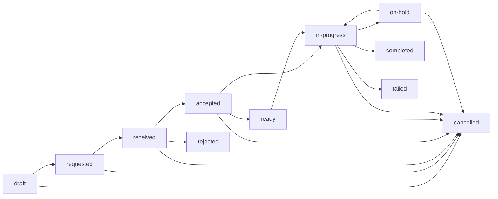

# 第四层第 3 步验收：双审批规则与 Task 责任闭环

- 版本：0.1.0（2026-08-02）
- 范围：规则执行门禁、确定性条件解释、FHIR Task 去重和版本化状态机
- 结论：**第 3 步执行基础设施通过；仓库仍无真实获批临床规则，因此当前产品路径继续返回 `not_assessed`，不会自动创建临床 Task。**

## 1. 本步目标

本步建立一个只有显式获批规则才能进入的独立执行边界：

```text
最终 Observation + 路径/区域/数据环境上下文
→ active + 临床批准 + 术语批准门禁
→ 确定性条件评估与逐条件解释
→ no_match / not_assessed / matched
→ matched 时创建或复用版本化 FHIR Task
→ 人工状态转换 + Provenance + Clinical Memory
```

规则执行不调用 LLM，也不读取患者聊天或模型中间结果。测试中使用的规则只在临时测试数据库构造，不会写入 `GLP1-14D` 路径清单。

## 2. 执行门禁

`ApprovedRuleEngine` 只装载同时满足以下条件的当前规则版本：

1. `lifecycle=active`；
2. 临床审批为 `approved`，且有审批人和时间；
3. 术语审批为 `approved`，且有审批人和时间；
4. 路径代码和路径版本完全一致；
5. 区域、产品和 synthetic/production 数据环境适用；
6. 规则具有证据引用、测试用例 ID 和回退方案；
7. Task 责任角色存在明确的 FHIR owner 映射。

Draft、in-review、approved 但未 active、路径版本不一致或没有双审批的规则都不能执行。没有可执行规则时结果固定为：

```text
status = not_assessed
reason = no_active_dual_approved_rule
Task = none
```

旧版 `continucare.services.risk_rules.evaluate_risk()` 仍保持原有 `not_assessed` 行为；第 3 步没有把测试执行器静默接入患者流程。

## 3. Observation 与条件评估

规则引擎再次执行第四层输入约束：

- 只接受有效的 FHIR R4 `Observation`；
- 只接受 `status=final`；
- `subject` 必须与当前患者一致；
- 必须具有带时区的有效时间和 issued/lastUpdated；
- issued 晚于评估时点的资源不能参与历史重放；
- Observation 必须落入规则输入定义的 lookback 时间窗；
- code system、code 和单位必须精确匹配。

当前支持 `eq / ne / gt / gte / lt / lte / in`。数量比较使用精确十进制转换；系统不擅自换算单位。规则输入单位和条件单位冲突时，规则合同本身即无效；Observation 单位不一致时返回 `not_assessed + unit_mismatch`。

每个条件输出：

- condition index、input ID 和 operator；
- 实际值、期望值和单位；
- `matched / not_matched / not_assessed`；
- 原因码；
- 具体 Observation 版本的 `EvidenceReference`。

`all` 逻辑只在全部条件可评估且全部匹配时行动；`any` 逻辑可在一个完整分支已匹配时行动，同时保留其他分支的缺失或不匹配解释。

## 4. Task 创建与去重

只有最终规则结果为 `matched` 时才可能创建 Task。Task 保存：

- 规则 ID 和版本；
- 患者、requester、owner 和任务编码；
- 优先级、SLA 截止时间；
- 首要 trigger Observation；
- 全部触发 Observation 版本作为 `Task.input.valueReference`；
- 规则和路径 URN 作为 basedOn；
- 评估与 Task 的 FHIR Provenance。

同一患者、同一规则版本在 `deduplication_window_hours` 内只保留一个 Task；重复执行相同输入得到相同结果和 Task。窗口外的新触发允许创建新 Task。`entered-in-error` 的 Task 不参与去重，避免错误任务阻断后续有效工作项。

## 5. Task 状态机

状态不能任意覆盖，每次转换都会创建新的 `meta.versionId`：



所有非终态还允许受审计地转入 `entered-in-error`。每次操作要求：

- 明确 actor FHIR reference；
- 非空处理说明；
- 严格晚于当前版本的带时区时间；
- 新 Task 版本；
- 指向前后版本的 Provenance。

`rejected / cancelled / failed / completed / entered-in-error` 为终态，不能继续转换。完全相同的重试是幂等的；同一目标状态但责任人、说明或时间不同会被拒绝。

## 6. Clinical Memory 集成

Task 新版本进入 Clinical Memory 后：

- 默认 Timeline 只展示当前 Task 版本；
- 旧版本通过 `RevisionLink(SUPERSEDES)` 退出当前视图；
- `include_history=True` 可查看全部版本；
- `entered-in-error` 版本不进入默认当前视图，但保留 Task JSON、Timeline、RevisionLink 和 Provenance。

因此工作流处理不会制造多个看似同时有效的 Task 事件，也不会物理删除历史。

## 7. 当前安全边界

第 3 步完成的是执行器和责任闭环，不是临床规则发布：

- `continucare/pathways/data/glp1_14d_v1.json` 仍为 `clinical_rules=[]`；
- 不存在仓库内 active 临床规则；
- 不产生风险等级或诊断结论；
- 不生成 Alert、急症指令、治疗或用药建议；
- 不做 UCUM 单位换算；
- 不执行趋势、复杂时序或人群统计规则；
- 不替代真实身份授权、医院审批和临床验证。

生产启用仍需要真实规则来源、双审批记录、目标人群/产品范围、验证集、责任角色和回滚方案。

## 8. 验收结果

启用 HL7 官方 R4 Schema 校验时：

```text
127 passed
0 failed
0 skipped
```

第 3 步新增 15 个规则/Task 相关测试场景，覆盖：

- 无规则和 Draft 规则保持 `not_assessed`；
- active 双审批规则的匹配、逐条件解释和证据绑定；
- 重复评估、去重窗口和窗口外新 Task；
- no-match、缺失、过期数据、单位错误、区域不符和 owner 未映射；
- final 状态门、患者门和 any 条件逻辑；
- Task 合法状态链、非法跳级、空说明、倒序时间和终态保护；
- 完全相同状态转换重试幂等；
- `entered-in-error` 后允许新任务且旧任务保留历史；
- Task 多版本在 Clinical Memory 中只有一个当前版本；
- 生成和转换后的 Task/Provenance 通过 HL7 官方 R4 Schema。

同时继续通过：

- 7 类资源统一 HL7 R4 Schema 验证；
- 第三层离线语义回归 8/8；
- 无外部服务演示彩排 3/3；
- Python 编译检查和差异格式检查。

## 9. 后续进展

以下第 4 步内容已完成，验收结果见 [21_layer_4_evidence_summary_and_doctor_review.md](21_layer_4_evidence_summary_and_doctor_review.md)：

1. 只从当前 Timeline、缺失、冲突和 Task 处理历史取材；
2. 每条摘要内容必须绑定 EvidenceReference；
3. LLM 只能组织文字，不能增加临床事实或风险等级；
4. Safety 复核失败时回退确定性 Timeline；
5. 医生支持接受、修改、拒绝，并保留前后版本和 Provenance；
6. 未审阅草稿不得成为患者指令或正式病历结论。
