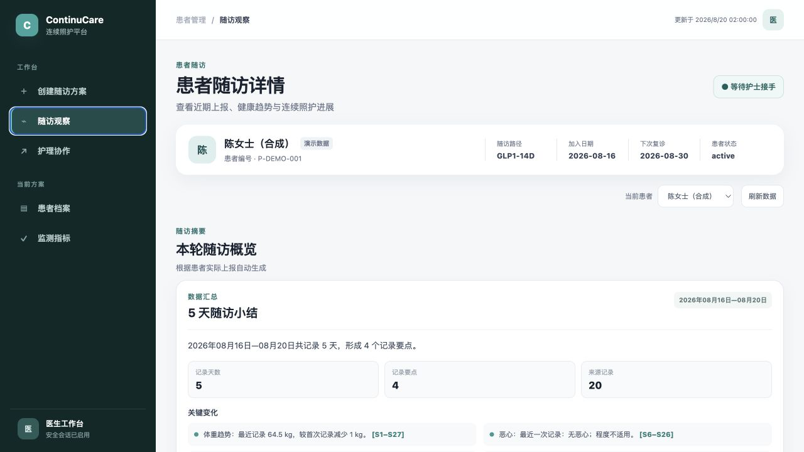
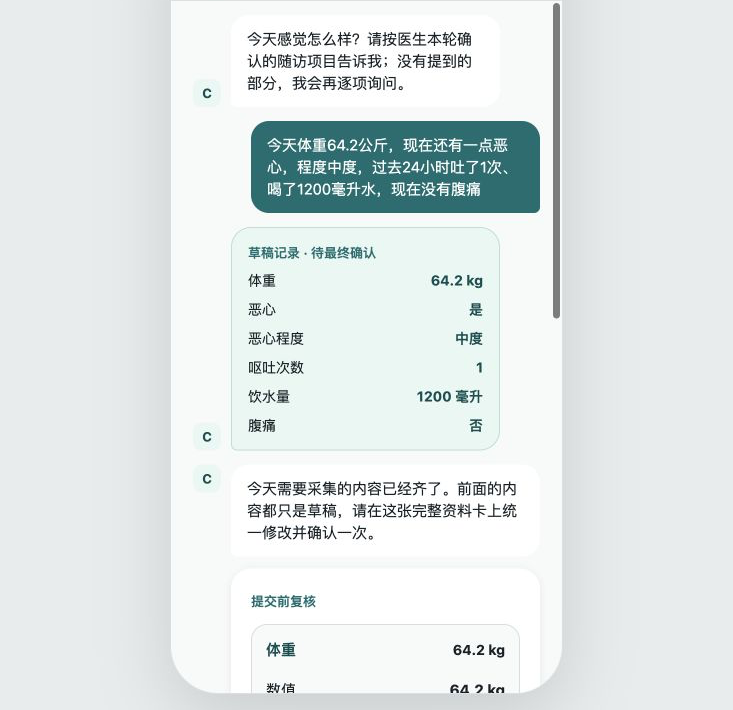
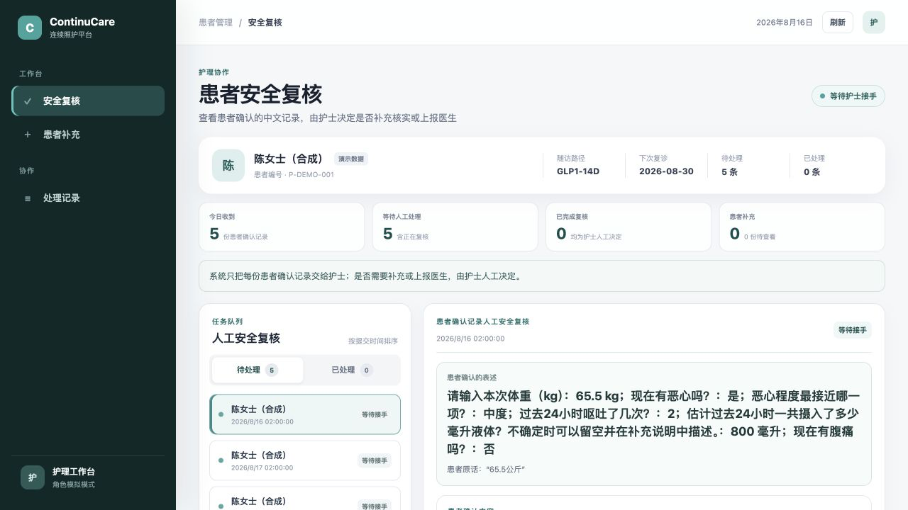
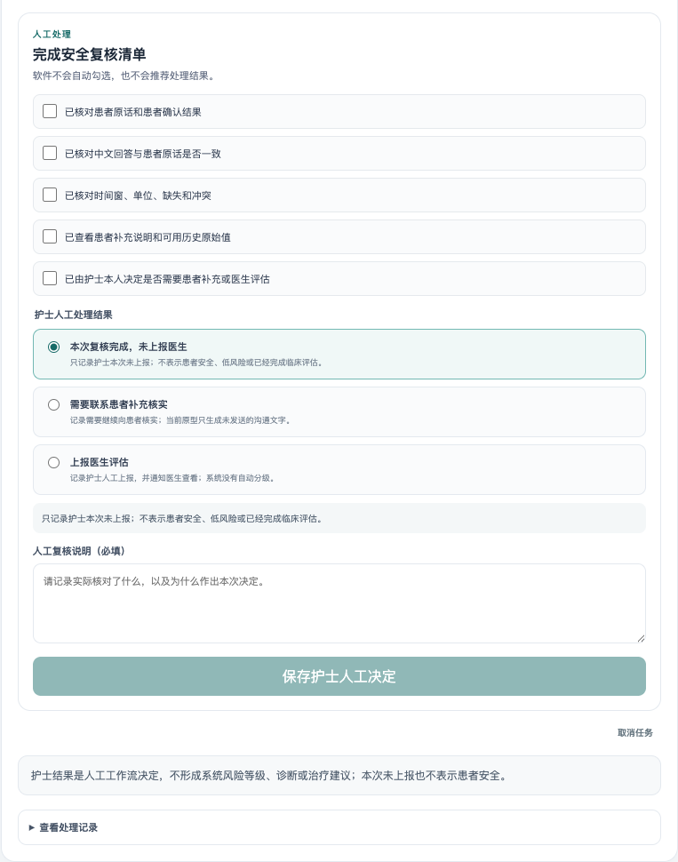
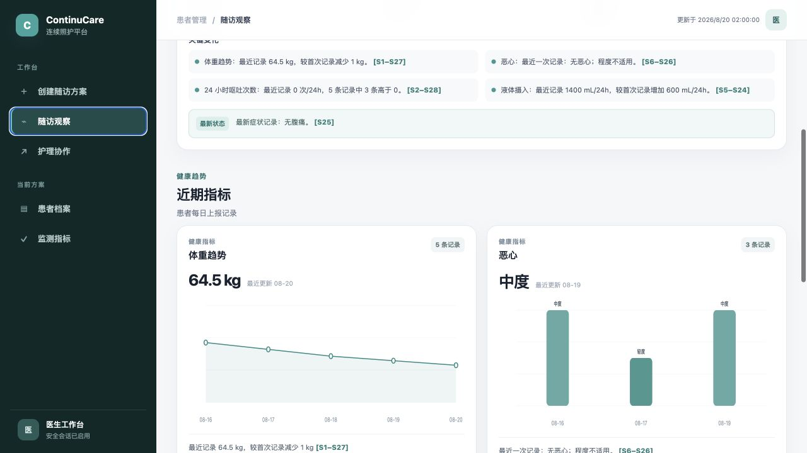
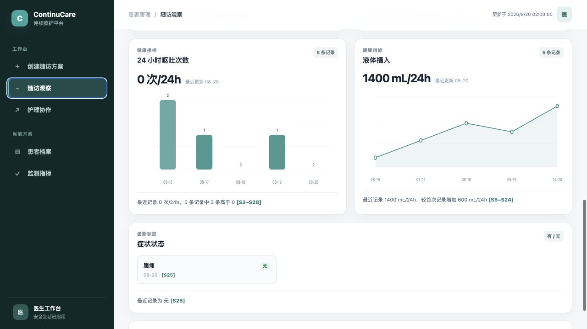
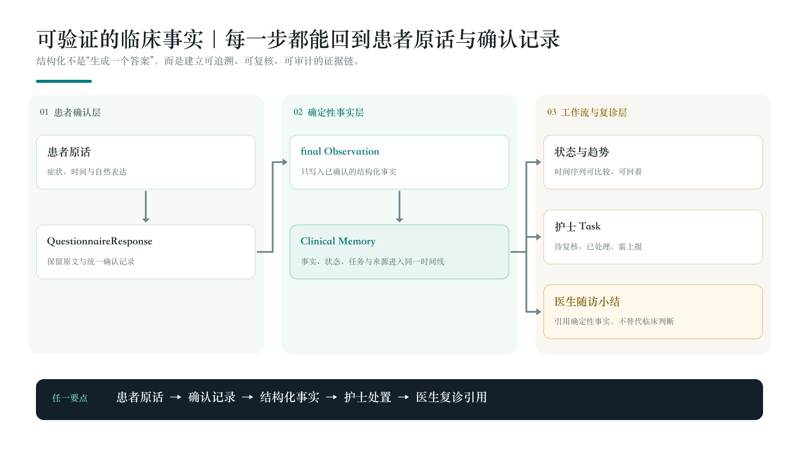
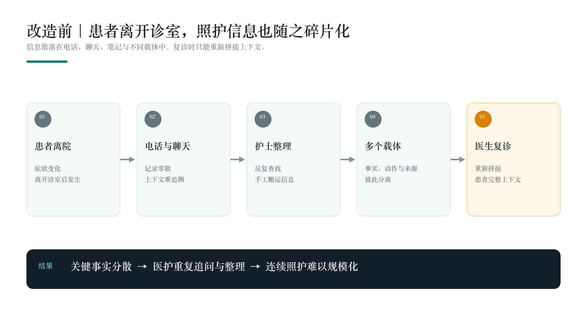
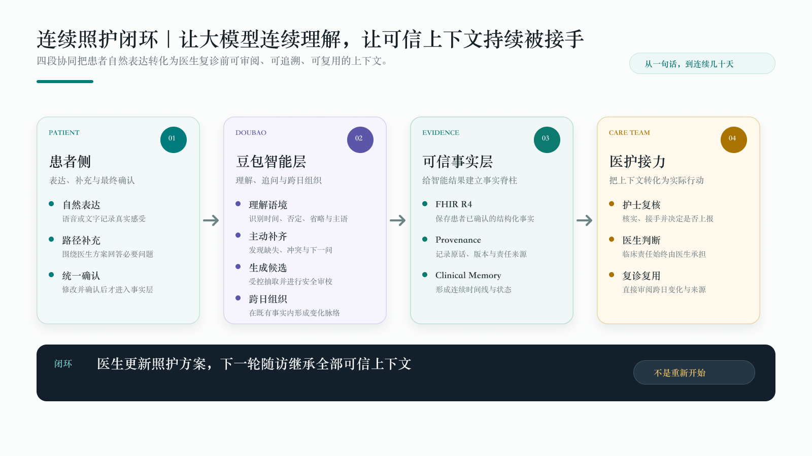
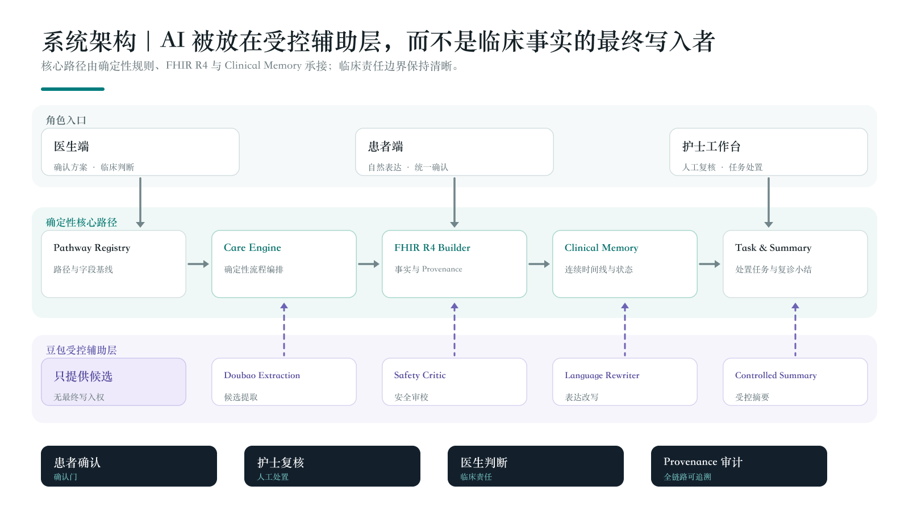

# ContinuCare Copilot：让院外随访不断线，让复诊获得完整数据

> **初诊和复诊之间，患者大部分时间在院外，院方很难持续、完整地掌握症状和关键指标的变化。ContinuCare 由医生设定随访周期、照护路径和观察指标，豆包持续理解并记录患者反馈，护士在过程中监控、复核和接手；复诊前，系统形成带来源证据的结构化总结，帮助医生更高效、更有依据地完成复诊评估与诊疗决策。**

**医生配置随访路径 · 豆包持续跟踪记录 · 护士监控复核接手 · 复诊前结构化汇总**

## 一、参赛方案信息卡

| 项目 | 内容 |
| --- | --- |
| 队名 | 慕尼黑空调 |
| 命题 | 和睦家医疗：设计一套贯穿医生诊前诊后的连续照护 AI Copilot |
| 方案名称 | ContinuCare Copilot |
| 一句话摘要 | 医生确认随访周期、照护路径和需要记录的指标；豆包沿路径持续追问、记录并串联变化，患者确认事实，护士监控和接手处理，系统在复诊前形成可审阅、可追溯的结构化资料。 |
| 成员与分工 | 李忻睿：产品架构、受控 AI、FHIR/Clinical Memory、豆包迁移、三端整合与参赛材料；章子悦：三端体验、知识治理、安全与持久化加固、随访计划及 Demo 视频。 |
| 使用的飞书 AI 能力 | 企业豆包 Doubao-Seed-2.0-lite；飞书用于企业导师沟通、团队协作、进度同步和材料讨论。 |
| 当前成果 | 仅使用合成数据的患者、护士、医生三端 Web 产品；可配置随访周期与路径；路径感知对话与角色化生成；版本化事实库；人工安全复核；证据回链与审计。当前以 5 天合成样例验证完整闭环。 |

---

## 二、方案成果展示

### 2.1 初诊与复诊之间，院方难以持续掌握患者变化

患者离院后，大部分恢复和病情变化发生在医院之外。院方通常无法像住院期间一样持续了解患者的症状、关键指标和依从情况：患者反馈散落在电话、聊天和表格中，护士需要人工整理，医生到复诊时还要重新询问和拼接历史。

这不是“少做了一次随访”，而是三条链同时断开：

- **事实断线**：患者原话、数值、症状和补充说明散落在不同载体；
- **时间断线**：单次记录无法回答“这几天发生了什么变化”；
- **责任断线**：谁确认、谁复核、谁上报、医生是否看过，缺少连续记录。

> **ContinuCare 的产品命题：让患者说人话，让系统形成可信上下文，让医护做决定。**

### 2.2 ContinuCare 如何补上院外随访这一段

医生首先确认本次随访的周期、频率、照护路径和需要记录的指标；患者在院外用自然语言反馈，豆包围绕这条路径理解、追问和整理；患者确认后，护士持续查看、复核并在需要时接手；系统将整个周期内的记录组织为结构化信息，在复诊前向医生呈现变化趋势、最新状态、护理动作和来源证据。

随访周期并不固定为 5 天。它可以根据病种、治疗阶段和患者情况调整，并且必须由医生确认后才启动；提问频率、观察指标和停止条件也随路径版本配置。

当前合成演示使用一段 5 天随访数据验证这条闭环。下列数字是演示样例，不是产品的周期、容量或效果上限：

| 当前合成演示样例 | 示例数据 |
| --- | ---: |
| 演示随访周期 | 5 天；实际由医生设置并可调整 |
| 患者确认形成的医生审阅要点 | 4 组 |
| 保留的来源记录 | 20 条 |
| 参与责任链的角色 | 患者、护士、医生 |
| 自动临床结论 | 0 条；由医护人工决定 |

**演示数字只是为了证明完整流程已经跑通。真正的产品能力是：在医生设定的随访周期内持续记录，复诊前先呈现结构化变化，需要时仍可回到每一条来源。**

*图 1：当前合成样例将 5 天记录组织为 4 组复诊要点，并保留 20 条来源记录，用于展示可配置随访周期的医生视图；这些数字不代表产品上限。*

### 2.3 一个演示病例，如何形成医生复诊前的一屏上下文

以下患者、周期和数值均为合成演示数据。以陈女士为例，随访开始时，她没有填写一组抽象字段，而是直接描述：体重 65.5 kg、有中度恶心、过去 24 小时呕吐 2 次、饮水约 800 mL、现在没有腹痛。

在传统流程中，这句话可能停留在电话记录或聊天窗口里。ContinuCare 让豆包与确定性服务完成六步智能接力：

1. **沿照护路径理解与追问**：豆包结合当前随访阶段理解口语、省略、时间和否定；信息不足时只围绕医生批准的路径继续追问；
2. **从原话生成受控候选**：豆包提取时间、主语、数值、单位和证据位置，本地确定性安全门检查遗漏、冲突和越界表达；
3. **从候选变成患者事实**：完整资料卡交给患者统一修改和确认，未确认内容不进入长期事实层；
4. **从单次事实变成周期内上下文**：Clinical Memory 保存有效时间、版本、缺失与冲突，豆包在既有 fact ID 内组织变化脉络；
5. **从患者事实变成护理任务**：确认记录进入护士人工复核队列，豆包帮助突出待核实信息，护士决定补充、完成或上报医生；
6. **从整个随访周期形成复诊预览**：医生看到跨日趋势、最新状态、护理接手和带来源引用的审阅要点，而不是重新阅读分散的聊天记录。

*图 2：豆包把自然表达组织成可检查的候选资料卡；患者拥有修改权和最终确认权。*

### 2.4 护士如何接手：先看证据，再做人工决定

患者统一确认后，每份记录都会创建护士人工安全复核任务。队列把提交时间、待处理数量、患者原话和已确认答案放在同一工作台；系统不会预先把记录标成“高风险”或“低风险”，也不会替护士推荐处理结果。

*图 3：当前演示样例中的 5 份患者确认记录进入护士队列。护士先看到患者原话和确认事实，再决定是否接手处理。*

护士接手后，需要逐项核对患者原话与确认结果、中文回答的一致性、时间窗、单位、缺失与冲突，以及可用的补充说明和历史原始值。完成检查后，护士本人在三种结果中作出选择并填写复核说明：本次未上报、联系患者补充核实，或上报医生评估。系统保存责任记录，但不会把护士操作转换成自动风险等级。

*图 4：护士必须完成人工检查清单并填写说明，才能保存“未上报、补充核实或上报医生”的人工决定；软件不自动勾选，也不推荐结果。*

### 2.5 医生得到的是复诊前可审阅的跨日上下文

护士完成复核或上报后，医生端从同一条记录链读取跨日事实、护理动作与证据引用。医生先扫描一屏变化，需要时仍能下钻到患者原话、确认内容和责任记录。

*图 5：医生看到跨日变化及来源引用，而不是一段无法下钻的生成文字。*

*图 6：当前合成样例显示呕吐次数从首日 2 次降至最新 0 次，液体摄入从 800 mL 增至 1400 mL；数值用于展示趋势能力，系统只陈述事实变化，不解释临床意义。*

---

## 三、四个让 ContinuCare 值得被记住的产品突破

### 突破一：从“AI 说了什么”转向“系统能证明什么”

患者原话不会被摘要覆盖。患者确认后，确定性服务保存 QuestionnaireResponse；安全映射的事实形成 Observation，并通过 `derivedFrom` 回到来源回答；Clinical Memory 记录有效时间、修订、缺失和冲突；护士 Task、医生审阅和 Provenance 继续连接责任链。

*图 7：任何医生端要点都可以沿着 Clinical Memory、FHIR 事实和患者确认记录逐层回到患者原话。*

这一设计改变了医疗 AI 的评价对象：不再要求医生“相信模型写得像不像”，而是让医生检查“事实来自哪里、谁确认过、后来谁处理过”。

### 突破二：从“演示页面里的数据”转向“医院可接入的标准化临床数据”

ContinuCare 保存的不是只能在当前页面中查看的一段 AI 文本，也不是一份缺少语义和来源关系的私有 JSON。患者确认、结构化事实、护士任务和责任记录分别以 FHIR R4 资源结构表达，并由 Clinical Memory 维护跨日版本关系。

| 院外照护信息 | 当前保存形式 | 为医院对接提供的基础 |
| --- | --- | --- |
| 患者原话与最终确认内容 | `QuestionnaireResponse` | 保留问题、回答、确认状态和路径版本 |
| 症状与关键指标 | `Observation` | 保留编码、数值、单位、有效时间，并通过 `derivedFrom` 回到患者回答 |
| 护士复核与上报过程 | `Task` | 保留任务状态、处理人、处理结果和工作流时间 |
| 谁在何时处理了什么 | `Provenance` | 为资源补充操作者、时间、目标和责任关系 |
| 跨日变化、修订与冲突 | Clinical Memory | 维护稳定事实标识、版本、有效时间及来源链 |

因为数据拥有明确的资源类型、稳定标识、时间、单位、版本和来源关系，它不会被锁在 ContinuCare 的界面中。进入医院后，可依据目标医院的 FHIR Profile、患者身份体系、权限规则和接口规范，将这些资源映射到 HIS、EMR 或临床数据平台，成为能够继续查询、复用和审计的院外临床资料。

> **当前原型已经跑通标准化资源生成、本地持久化、版本管理和证据回链，但尚未连接真实医院生产系统。实际对接仍需完成患者身份匹配、SSO 与组织权限、患者授权、医院 FHIR Profile 适配、接口联调和安全验证。**

### 突破三：从“保存聊天历史”转向“维护连续临床记忆”

聊天历史按消息排列，Clinical Memory 按临床有效时间组织事实。ContinuCare 区分：

- 当前事实、历史事实与迟到记录；
- 正常缺失、信息未知与事实冲突；
- 原记录、修订记录与撤回关系；
- 采集时间、实际发生时间和进入系统时间。

因此，医生看到的不是“患者聊过什么”，而是“在这段时间里，哪些事实成立、如何变化、证据是否完整”。

### 突破四：从“AI 自动分级”转向“AI 组织证据，人工承担决定”

在没有目标医院批准的临床规则时，系统明确返回 `not_assessed`，不会把“没有自动告警”写成“患者安全”。每份记录进入护士人工复核；只有护士明确上报，医生端才出现护理协作待办；医生保留最终临床判断权。

| 常见 AI 产品终点 | ContinuCare 的终点 |
| --- | --- |
| 生成一段回复 | 形成患者确认、可追溯的事实 |
| 保存一段聊天 | 建立跨日、可修订的 Clinical Memory |
| 数据停留在私有页面或私有字段 | 保存为可映射至医院系统的标准化临床资源 |
| 模型给出风险标签 | 系统交付证据，护士和医生作出决定 |
| 摘要替代原始信息 | 摘要先可扫描，所有内容仍可回到来源 |

---

## 四、AI 深度：豆包进入核心链路，但不能越过事实门

ContinuCare 不是把大模型放在页面角落回答问题，也不只让它“把一句话转成字段”。Doubao-Seed-2.0-lite 贯穿患者表达、路径追问、语义审校、跨日组织和分角色交付；确定性服务则为它提供允许范围、事实版本和证据边界。

| 智能阶段 | 豆包负责 | 本地系统负责 | 失败时 |
| --- | --- | --- | --- |
| 路径感知理解与追问 | 理解口语、省略、时间关系和当前对话上下文，提出下一条必要问题 | Pathway Registry 决定允许询问的主题、必填项、顺序和停止条件 | 当前三端主流程安全停止本次整理并保留既有状态 |
| 受控语义抽取 | 从自由表达中识别候选、时间、主语、否定、数值、单位和证据位置 | 白名单、Schema、术语、单位和逐字证据校验 | 当前三端主流程拒绝本次整理，不写入候选或最终事实 |
| 安全审校 | 当前三端不调用独立 Safety LLM | 本地硬规则检查遗漏、冲突和越界表达，并拥有最终否决权 | 拒绝本次整理并保留已有状态 |
| 患者确认表达 | 当前三端不调用独立语言 LLM | 本地界面按受控事实展示确认语言，锁定数字、单位、症状、程度、肯否和时间 | 保留确定性展示 |
| 跨日上下文组织 | 当前三端不调用模型解释趋势 | Clinical Memory 计算版本、有效时间、确定性趋势和来源关系 | 展示完整确定性时间线 |
| 分角色视图 | 当前三端不调用 Summary LLM | 本地服务按角色组织事实、任务、证据引用与版本 | 展示完整确定性事实清单 |

模型不能直接创建 Observation、风险等级、医护任务、患者确认或临床建议。它的价值不是替医生下结论，而是在医生设定的随访周期内持续理解患者表达，把分散信息组织成不同角色可以立即接手的上下文。所有模型调用记录模型、Prompt 版本、请求 ID、延迟、失败原因和回退路径；密钥不进入数据库或审计正文。

> **AI 负责连续理解、主动补齐和分角色组织，系统负责验证和证明，患者与医护负责确认与决定。**

---

## 五、Before / After：我们改变的不是一个页面，而是一条照护链

### Before：信息被收集了，但上下文仍然消失

*图 8：电话、聊天和表格完成了“联系患者”，却没有形成可确认、可接手、可复用的连续事实。*

### After：每次表达都进入一条可确认、可接手、可追溯的链

*图 9：患者记录、豆包候选、患者确认、护士复核、医生复用和审计形成责任明确的闭环。*

| Before | After |
| --- | --- |
| 复诊时重新询问和拼接历史 | 复诊前直接审阅跨日上下文 |
| 自然语言只能停留在聊天记录 | 患者确认后形成可追溯事实 |
| 摘要难以证明来源 | 每个要点和图表数据点均可回链 |
| 患者、护士、医生使用孤立工具 | 三个角色共享同一事实与任务状态 |
| “没有告警”容易被误解为安全 | 未评估就是 `not_assessed`，由人工接手 |
| 模型不可用时可能产生不可信结果 | 主流程 fail-closed，保留已有状态并明确要求重试 |

---

## 六、业务价值：把院外信息成本变成可测量的流程指标

### 对医生：更快建立复诊上下文

- 先看结构化的关键变化，再按需下钻完整来源记录；当前演示样例为 4 组要点和 20 条来源；
- 减少从电话、聊天、表格中重新拼接信息；
- 明确区分患者事实、护士动作和系统状态；
- 不需要相信模型本身，只需要审阅证据。

### 对护士：从整理信息转向接手任务

- 每份患者确认记录自动进入统一队列；
- 原话、结构化回答、时间窗和来源在同一界面展示；
- 补充核实、完成复核和上报医生都有责任记录；
- 任务积压和处理状态可以被运营管理。

### 对患者：少重复讲述，保留表达权

- 可以使用自然语言，而不是被迫理解专业字段；
- 在写入前看到系统如何理解，并统一修改、确认；
- 后续补充不会静默覆盖已经确认的历史；
- 紧急情况始终提示联系急救服务或前往急诊。

### 对医院：得到一套可复制的连续照护基础设施

医院得到的不是一套只能独立运行的演示应用，而是一层可供现有医院系统对接的院外数据基础。患者反馈从进入系统开始就被保存为可识别、可映射、可追溯的标准化资源，后续可以在医院批准的接口和权限边界内进入既有临床工作流。

推广单元不是重新开发一套应用，而是版本化的：

> **Pathway + Questionnaire + Observation Mapping + 护理工作流 + 医生 Summary 视图**

当前用 GLP-1 随访证明闭环；后续可复用于术后恢复、慢病管理和其他需要跨角色院外协作的场景。

### 首期试点如何验证价值

| 指标 | 计算方式 | 需要验证的价值 |
| --- | --- | --- |
| 医生复诊准备时间 | 试点前后单患者准备时间中位数 | 连续上下文是否减少信息拼接 |
| 重复追问次数 | 复诊中重复询问已记录问题的数量 | 历史事实是否真正被复用 |
| 护士单份复核耗时 | 接手至完成的活跃处理时间 | 统一证据视图是否减少整理 |
| 任务闭环时间 | requested 至 completed 的时间分布 | 责任链是否让积压可见 |
| 证据完整率 | 可回到原话和标准化记录的要点占比 | 摘要是否值得信任 |
| 安全越界率 | 预定义安全测试中未拦截越界输出占比 | 受控 AI 边界是否有效 |

本项目不预设临床效果或虚构改善比例；所有收益在目标医院试点中以前后对照验证。

---

## 七、可落地性：确定性主链 + 受控 AI + 全程人工门

*图 10：豆包承担路径追问、候选提取、安全审校、跨日组织和分角色表达；确定性服务控制事实、状态、权限和版本；人工确认与审计贯穿主链。*

架构中的 FHIR 与 Clinical Memory 数据层把三端操作转化为标准化资源和连续事实。当前原型使用本地数据库验证完整性、幂等和版本关系；生产落地时，该数据层可按医院 Profile 与接口规范接入 HIS、EMR 或临床数据平台，而不需要重新把页面内容人工整理成医院数据。

### 当前已经跑通

- 患者、护士、医生三个独立 React 界面；
- 医生确认随访方案后才开启患者记录；
- 路径感知对话、患者自然语言整理、统一确认和持续补充；
- QuestionnaireResponse、Observation、Task、Provenance 与 Clinical Memory 的资源化生成和本地持久化；
- 每份确认记录创建护士人工复核 Task；
- 跨日上下文组织，以及面向患者、护士和医生的不同信息视图；
- 可配置随访周期的医生概览、趋势、护理协作和证据引用（当前合成样例为 5 天）；
- SQLite 持久化、幂等、generation 并发护栏与审计回放；
- 豆包受控语义抽取；失败时主流程不写入并保留已有状态，本地确定性门负责后续验证。

### 进入医院的最小路径

1. **比赛原型**：单一合成患者、单 Pathway、三端闭环；
2. **单科室旁路试点**：只读导入基础信息，与科室共同批准问卷、术语、护理清单和角色责任，并完成目标医院 FHIR Profile 与身份字段映射；
3. **医院工作流集成**：接入 SSO、组织权限、FHIR/EMR Profile、患者授权和审计；
4. **复制推广**：发布新的 Pathway、Questionnaire、Mapping 和工作流版本，扩展至更多科室。

### 医疗安全边界

- 当前仅使用合成数据，不是临床试点或生产系统；
- 不诊断、不治疗、不自动分诊、不生成用药建议；
- 无医院批准规则时不生成 L0–L4 或自动处置建议；
- 护士上报是工作流动作，不等于诊断或风险结论；
- 真实患者使用前仍需伦理、法务、隐私、信息安全、临床和术语审批。

---

## 八、体验、工程证据与飞书协作

### 体验与 Demo

| 项目 | 内容 |
| --- | --- |
| GitHub | https://github.com/xli561980-ship-it/continucare-demo |
| 演示数据 | 固定合成患者陈女士；不使用真实医疗身份或病历 |
| 建议体验顺序 | 医生启动 → 患者确认 → 护士复核 → 医生查看 → 证据追溯 |
| Demo 视频 | 章子悦负责策划、录制与剪辑，随参赛材料提交 |

### 工程证据

- 三端集成、患者 Web API、医生 Web API、护士 Portal 及模型接口安全定向回归：`53 passed`；
- 患者/护士 React 前端 Vite production build 通过；
- 医生 React 前端 Vite production build 通过；
- 测试数字只代表工程回归，不代表临床准确率或真实患者效果。

### 飞书与豆包的实际使用

1. **企业豆包**：当前三端主流程使用 Doubao-Seed-2.0-lite，通过火山方舟 OpenAI-compatible 接口完成患者路径内的受控语义抽取；Safety/语言/Controlled Summary 模块在仓库中作为独立能力保留，但没有接入本次三端主路径；
2. **企业导师沟通**：团队通过飞书沟通命题理解、产品边界、阶段进展和反馈；
3. **团队协作**：两位成员通过飞书同步任务、设计决定、测试结果和参赛材料，GitHub 保存工程版本与贡献记录。

---

## 九、团队成员与贡献

| 成员 | 角色 | 实际贡献 | 可核验材料 |
| --- | --- | --- | --- |
| 李忻睿 | 产品架构与 AI 工程、最终材料 | 搭建初始完整 Demo 与分层架构；完成 FHIR 基础、受控对话 Agent、Clinical Memory 与 Controlled Summary；在当前版本完成豆包迁移、三端整合、可配置随访周期的合成演示数据、截图与参赛方案。 | GitHub 远端分支可核验 11 个非合并提交；当前产品与提交材料 |
| 章子悦 | 工程共建、知识治理与 Demo 视频 | 完善患者、护士、医生体验；建设知识与术语治理、人工复核、持久化、安全与隐私护栏、随访计划等能力；负责 Demo 视频。 | GitHub 远端分支可核验 81 个非合并提交；Demo 视频 |

协作过程中，团队用飞书完成导师沟通、任务同步和材料讨论，用 GitHub 保存实现历史，并共同复核医疗边界与演示事实。

---

## 十、团队迭代故事

ContinuCare 最初也曾接近常见的“自动风险分级 Demo”。但当团队认真追问“没有经过医院批准的规则，系统凭什么判断患者风险”时，我们放弃了更炫但不可信的自动标签，转向护士全量人工安全复核。

这次转向塑造了整个产品：

- AI 输出必须先成为候选，而不是事实；
- 患者拥有统一确认权；
- FHIR 资源只能由确定性代码构造；
- 护士承担复核与上报责任；
- 医生端展示证据和变化，不替医生解释临床意义；
- 模型迁移到 Doubao-Seed-2.0-lite 后，人工门和确定性验证仍然不变；模型失败时本次写入安全停止。

我们认为，医疗 AI 真正的创新不是让模型拥有更多权力，而是让模型在一套值得信任的协作系统里发挥更大的作用。

---

## 十一、参考资料

- 2026 AI先锋未来人才大赛和睦家医疗企业命题；
- HL7 FHIR R4 Specification；
- 火山方舟豆包 OpenAI-compatible 接口与 JSON mode 说明；
- 飞书开放平台相关官方文档；
- 项目 README、PRD、系统架构、安全治理、知识来源与工程验收材料。

---

## 结语

医院不应该只能在初诊和复诊两个节点了解患者。

ContinuCare 由医生设定随访周期、照护路径和观察指标，让豆包持续理解并记录患者反馈，让护士在过程中监控和接手，再把整个周期的变化整理成医生复诊前可审阅、可追溯的结构化资料。

> **让院外随访不断线，让医生在复诊前获得更完整的患者变化数据。**
